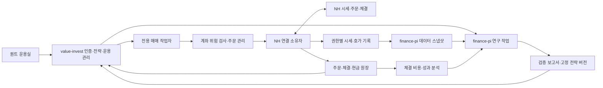

# 퀀트 운용실: 상대가치 연구·백테스트·자동매매 기획

작성일: 2026-09-15 · 상태: **기획안, 구현·실거래 활성화 전**

사용자 우선순위: **보통주·우선주/ETF 상대가치 + 중저빈도 퀀트**.
코드 확인 기준: value-invest `488b3a15`, finance-pi `296e593`.
현재 NH 연동의 사용법은 [계좌 관리·NH 연동 안내](portfolio-accounts.md), 기존 설계 배경은 [NH 연동 설계](namuh-integration-plan.md)를 참고한다. 이 문서는 그 위에 추가할 연구·운용 제품의 범위와 완료 기준을 정한다.

읽는 순서: 제품 판단은 1·3·4·5·12절, 개발 착수는 2·6·7·8·10·11절, 남은 결정은 13절을 우선한다.

## 1. 제품 방향과 첫 출시

**투자 아이디어를 검증 가능한 전략으로 만들고, 허용한 자금과 위험 범위에서 운용하며, 실제 체결 결과로 다음 연구를 개선하는 개인용 퀀트 운용실을 만든다.**

기존 가치투자 포트폴리오를 기반으로 종목의 절대 가격과 상대 가격을 함께 판단한다. 사용자는 할인율이 큰 종목을 찾는 데서 끝나지 않고, 교체할 때 드는 비용과 기존 보유분의 위험까지 확인한 뒤 전략을 운용할 수 있어야 한다.

핵심 문제는 다음 세 가지다.

1. 분석 화면의 저평가 신호를 실제 주문으로 연결할 때 데이터 시각, 비용, 가용 현금, 다른 전략과의 충돌이 끊어진다.
2. 과거 수익률이 좋아도 당시 사용 가능했던 데이터인지, 실제 수량으로 체결할 수 있었는지, 여러 실험 중 우연히 좋은 결과인지 판단하기 어렵다.
3. 실거래 후 손익이 전략의 성과인지, 시장 상승·체결 비용·미체결 때문인지 설명하는 기록이 부족하다.

### 첫 출시 묶음

- **보통주·우선주 상대가치 교체**: 동일 기업에 배정한 예산 안에서 보유 주식 종류의 비중을 조절한다.
- **동일 지수 ETF 상대가치 교체**: 같은 경제적 노출을 유지하며 비용을 넘는 가격 차이를 활용한다.
- **가치·퀄리티·모멘텀 중저빈도 바스켓**: 여러 신호를 합성하되 종목 집중·회전율·기존 보유 노출을 제한한다.
- 세 전략 모두 **연구 → 검증 → 실시간 가상운용 → 제한 실거래 → 성과 분석**을 같은 흐름으로 사용한다.

첫 번째 완결 출시의 목표는 위 세 템플릿을 제공하고, 그중 사전 정의한 검증을 통과한 한 전략을 끝까지 운용 가능하게 만드는 것이다. 검증에서 탈락한 전략은 연구 상태로 남긴다. 템플릿 제공을 수익성 입증으로 표시하지 않는다.

### 성공의 의미

| 목표 | 측정 방법·초기 완료 기준 |
| --- | --- |
| 판단을 재현할 수 있다 | 모든 실주문에 전략 버전·입력 데이터·위험 검사·승인 범위·주문 의도 연결률 100% |
| 연구와 운용이 연결된다 | 동일한 과거 입력을 재생하면 신호·목표 수량이 동일하고 차이 원인이 모두 설명됨 |
| 계좌 사고를 막는다 | 장애 주입 시 중복 주문·한도 초과·다른 사용자 계좌 접근 0건 |
| 비용을 반영한 결정을 한다 | 거래 후보마다 예상 순효익·체결 가능 규모·미거래 사유 제공, 실제 비용과 비교 가능 |
| 운영 상태를 설명한다 | 결과 불명 주문과 잔고 불일치를 숨기지 않고 자동 재개를 차단함 |
| 투자 효용을 검증한다 | 사전 선택한 비교전략 대비 비용 후 성과·위험·회전율을 평가함. 고정 수익률 보장은 목표에 두지 않음 |

이 문서의 수치·기간은 별도 표시가 없는 한 **개발 검증용 제안값**이다. 사용자의 운용금액·손실 허용폭과 현재 시장에서 검증된 추천 파라미터가 아니다.

## 2. 현재 기반과 추가해야 할 것

### value-invest

| 코드에서 확인한 기반 | 기획에 미치는 영향 |
| --- | --- |
| `broker_credentials`, `broker_account_links`, `account_holdings`, 사용자·계좌별 잔고 | 인증·계좌 선택·암호화 저장·포트폴리오 표시를 재사용한다 |
| NH REST 어댑터 `READ_PATHS`는 조회만 허용 | 별도 주문 어댑터·업무 응답 판정·주문 원장이 필요하다 |
| `mc` 국내 통합 체결가, `g4` 금현물 체결가 수신 | 주문 대상의 호가·체결 통보·주문용 신선도 계약을 추가한다 |
| 연결 계좌를 약 5분마다 전체 동기화 | 체결 원장과 동기화 스냅샷이 서로 덮어쓰지 않도록 버전·대조 흐름을 추가한다 |
| 실계좌 조회 429 대응으로 최소 요청 간격 1.1초 | 앱키 전체 호출을 통합 관리하고 취소·복구 조회에 우선 예산을 준다 |
| 현재 웹앱 lifespan이 NH 작업을 시작함 | 실거래 전에 연결 소유권을 별도 상주 작업자로 옮긴다 |
| 계좌별 현재 평가와 사용자 전체 NAV 제공 | 전략별·계좌별 시점 원장과 외부 현금흐름 분리가 필요하다 |

근거: [NH 어댑터](../services/brokers/namuh.py), [실시간 작업](../services/brokers/realtime.py), [잔고 동기화](../services/brokers/sync.py), [계좌별 보유 원장](../repositories/account_holdings.py), [계좌 안내](portfolio-accounts.md).

### finance-pi

현재 코드에는 Parquet·DuckDB·Polars 기반 데이터레이크, `gold.universe_history`, `gold.fundamentals_pit`, `gold.daily_prices_adj`, `gold.preferred_discount`, 기업행동·배당 데이터와 팩터 분석 기반이 있다. 등록 코드는 **14개 팩터**이며 README의 13개 설명보다 `event_buyback`이 추가돼 있다.

| 재사용할 기반 | 실거래 검증 전 보완점 |
| --- | --- |
| `preferred_discount_z`와 보통주·우선주 관계 데이터 | 관계의 유효기간·주식 종류별 권리·기업행동·동일 가격 기준 검증 |
| 가치·수익성·발생액·모멘텀·저변동성·배당·수급 팩터 | 팩터별 실제 데이터 기간·PIT 품질·결측률 표시 |
| 재무정보의 `available_date < as_of_date` 규칙 | 공시 정정본의 역사 보존, 수집시각·데이터 수정 버전 추가 |
| 월별 리밸런싱과 신호일/진입일 분리 | 일·주·이벤트 평가 주기, 실제 수량·현금·호가 기반 체결 엔진 |
| 매수·매도 수수료와 매도세 모델 | 상품·시장·계좌·시행일별 비용표, 스프레드·충격·미체결 비용 |
| 품질 보고서·백테스트 점검 보고서 | 실험별 입력 스냅샷에 대한 강제 검증과 승격 차단 |
| `/api/ready`, 관리자 작업 API | 데이터별 준비 상태와 사용자별 연구 작업 API |

특히 기존 백테스트 결과를 실거래 성과로 해석하기 전에 아래 네 부분을 고친다.

1. **수량 원장**: 현재 엔진은 보유기간의 매일에 목표 비중을 다시 적용하고 비용은 리밸런싱 시 목표 비중 차이로 계산한다. 가격 변화에 따른 실제 비중 변동과 고정 주식 수량을 재현하는지 별도 엔진과 대조해야 한다.
2. **결측과 거래 불가**: `missing_return=0`, 결측 이후 기여 제거, 일부 상태 컬럼 부재 시 미지정 취급은 탐색용 가정이다. 실거래 검증에서는 수집 실패·거래정지·상장폐지·청산을 구분한다.
3. **API의 팩터 선택**: 현재 관리자 `backtest` 작업은 모멘텀·이익수익률·ROA 세 팩터만 허용하고, 다른 값은 기본 팩터로 바뀔 수 있다. 요청 전략을 다른 전략으로 바꾸지 않도록 명시적 거절과 결과의 버전 검증이 필요하다.
4. **사용 가능한 분류·시세**: 업종 중립화는 업종 이력이 추가돼야 가능하다. 현재 확인한 일봉·할인율 데이터만으로 일중 호가나 ETF iNAV의 과거 시점을 재현할 수 있다고 가정하지 않는다.

근거: [백테스트 엔진](../../finance-pi/src/finance_pi/backtest/engine.py), [설정](../../finance-pi/src/finance_pi/backtest/models.py), [비용 모델](../../finance-pi/src/finance_pi/backtest/costs.py), [PIT 규칙](../../finance-pi/src/finance_pi/pit/fundamentals.py), [팩터](../../finance-pi/src/finance_pi/factors/library.py), [합성 팩터](../../finance-pi/src/finance_pi/factors/composite.py), [중립화](../../finance-pi/src/finance_pi/factors/cross_section.py), [관리 API](../../finance-pi/src/finance_pi/admin/server.py).

위 내용은 로컬 코드 확인 결과다. 이번 기획에서 운영 데이터의 전체 커버리지, 사용자 키의 주문 권한, 전략 수익률을 실측한 것은 아니다.

## 3. 블룸버그에서 가져올 제품 원리

블룸버그의 공개 기능 자료를 참고해 연구, 포트폴리오 위험, 주문 실행, 사후 비용 분석이 이어지는 작업 흐름을 구현한다. 아래 오른쪽 열은 이 프로젝트를 위한 제안이다.

| 참조 기능 | 확인한 기능 축 | 퀀트 운용실에 적용 |
| --- | --- | --- |
| [BQuant](https://professional.bloomberg.com/products/bloomberg-terminal/research/bquant/) | Python 기반 데이터 분석·퀀트 연구 환경 | 데이터 탐색, 전략 템플릿, 버전이 고정된 실험, 결과 비교 |
| [PORT](https://professional.bloomberg.com/products/bloomberg-terminal/portfolio-analytics/) | 포트폴리오 성과·위험 분석 | 전략별 기여, 벤치마크 비교, 기업·팩터 노출, 주문 전후 위험 미리보기 |
| [EMSX 등 실행 관리](https://professional.bloomberg.com/products/trading/execution-management-system/) | 주문 실행과 거래 흐름 관리 | 부모·자식 주문, 부분 체결, 미체결, 분할 집행, 예외 처리 |
| [거래 자동화·Rule Builder](https://professional.bloomberg.com/products/trading/automation/) | 조건을 정의하는 자동 거래 흐름 | 신호·유동성·계좌 한도에 따른 자동 실행 정책 |
| [BTCA](https://professional.bloomberg.com/products/trading/trade-analytics/btca/) | 주문 전후를 연결하는 체결 비용 분석 | 판단가격 대비 손실, 스프레드·시장충격·미체결 비용, 실행 정책 개선 |

이를 종목을 선택하면 다른 패널도 함께 바뀌는 연결 화면으로 구성한다. 명령 검색에는 ‘우선주 기회’, ‘전략 비교’, ‘미체결’, ‘위험 예산’ 같은 한글 명령을 둔다. 공급자 내부 코드와 연결 슬롯은 운영 상세에서만 보여준다.

Bloomberg 데이터·단말·주문망 연동은 별도 계약 과제다. 본 기획의 계산과 주문 경로는 finance-pi 및 NH를 기준으로 한다.

## 4. 전략 체계: 차익 기회와 위험을 함께 표시

### 4.1 전략을 세 가지로 구분

| 분류 | 정의 | 초기 적용 |
| --- | --- | --- |
| 구조적 차익거래 | 동일한 경제적 권리의 전환·결제 관계와 양쪽 거래 수단이 확보된 가격 차이 | ETF 설정·환매, 선물·현물 등은 권한·자금·데이터 검증 후 확장 |
| 통계적 상대가치 | 과거 또는 경제적 관계를 기준으로 가격 차이의 축소를 기대 | 보통주·우선주, ETF 간 상대가치 |
| 보유자산 교체 | 기존 노출 안에서 보유한 자산을 팔고 상대적으로 유리한 자산으로 이동 | 초기 실거래의 중심 |

보통주·우선주는 배당·의결권·유동성·전환 조건이 다를 수 있고, 할인율이 영구적으로 바뀔 수 있다. 따라서 할인율 확대를 무위험 이익이나 확정적인 평균 회귀로 표시하지 않는다. 시장중립 여부도 두 자산의 이름이 아니라 실제 헤지·베타·잔여 노출로 판단한다.

ETF의 설정·환매는 발행시장과 AP를 통한 참여 구조를 가진다. 현재 보유 계좌에서 그 기능을 직접 실행할 수 있다고 전제하지 않는다. [KRX ETF 안내](https://m.krx.co.kr/contents/06/0609/060901/JHPETP060901M01.jsp)

### 4.2 전략 A: 보통주·우선주 상대가치

**사용자 가치**: 동일 기업에 투자하면서 평소보다 비싼 주식 종류의 비중을 낮추고 상대적으로 싼 종류의 비중을 늘린다. 공매도가 없어도 기존 보유분과 배정 현금 안에서 운용 가능하다.

#### 신호와 판단

- 기본 설명 지표: `할인율 = 1 - 우선주 가격 / 보통주 가격`.
- 동일 기업·권리 관계를 확인한 뒤, 과거 구간의 할인율 분포·배당 차이·거래대금·호가 간격·괴리 지속기간을 함께 본다.
- 초기 기준 모델은 기존 `discount_z`. 확장 모델은 과거 자료로만 추정한 회귀 잔차, 강건한 중앙값·변동폭, 관계 안정성 검사다.
- 추정 구간과 평가 구간을 분리한다. 관계 단절, 일회성 기업행동, 회귀기간의 급격한 증가를 신규 진입 보류 사유로 기록한다.
- 현재 할인율은 같은 시각의 실제 호가로 계산하고, 과거 수정주가의 비율을 현재 실행 가격으로 사용하지 않는다. 양쪽 주식의 조정계수가 다른 기간은 원주가·권리 변화 기준으로 비교 가능성을 먼저 검증한다.

#### 포지션 구성

- 기업별 총예산을 먼저 고정하고 보통주·우선주 내부 배분을 조절한다. ‘현재 보유 유지’, ‘항상 보통주’, ‘항상 우선주’, ‘고정 혼합’과 비교한다.
- 기존 보유분 매도와 신규 매수의 교체는 **보유 노출 조정**으로 표시한다. 숏 포지션을 가진 시장중립 페어와 분리한다.
- 헤지 모드를 추가할 때는 검증된 차입 가능수량·차입 비용·상환 조건과 추정 헤지 비율을 사용한다. 동일 수량 주문을 자동으로 헤지로 간주하지 않는다.
- 한 기업의 보통주·우선주·다른 전략 보유량을 합산해 기업 집중도를 제한한다.

#### 진입·유지·청산

| 상태 | 규칙 |
| --- | --- |
| 후보 | 과거 대비 할인율이 충분히 벌어졌고 관계·가격 데이터가 유효함 |
| 진입 가능 | 예상 순효익이 비용과 불확실성 여유를 넘고, 허용 수량·기업 예산·유동성을 충족함 |
| 보유 | 매일 관계·노출·잔여 기대효익을 평가하며 단순 가격 흔들림으로 불필요한 교체를 줄임 |
| 축소·복귀 | 목표 구간 복귀, 최대 보유기간, 관계 붕괴, 위험 예산 초과 중 사전 정의한 조건 발생 |
| 재진입 대기 | 청산 후 최소 대기 또는 더 강한 진입 조건을 적용해 반복 왕복 거래를 억제함 |

초기 연구는 ‘하루 한 번 신호 평가, 다음 허용 거래 구간에 실행’으로 시작한다. 장중 모니터링은 오래된 신호 취소·위험 감시·분할 집행을 담당한다.

### 4.3 전략 B: 동일 노출 ETF 교체

**사용자 가치**: 같은 지수에 투자하는 ETF를 비교해, 교체 비용을 넘는 상대가격 차이가 있을 때 이동한다.

- 초기 대상은 국내 기초자산을 가진, 동일 지수·통화·환헤지 정책·배당 처리·복제 방식의 비교 가능성이 검증된 ETF 묶음이다. 가격 수준이 다른 ETF는 수량 1:1 대신 기준가·경제적 노출로 정규화한다.
- 시장가격과 iNAV의 차이, 동종 ETF 간 정규화 가격 차이, 추적 차이, 호가 잔량을 함께 비교한다.
- ETF 보수처럼 NAV에 이미 반영된 항목은 가격 수익률에서 다시 차감하지 않는다. 미래 비교에서는 예상 보유기간의 비용 차이를 별도로 추정한다.
- 해외 기초 ETF는 기초시장 폐장·환율 시차·iNAV 갱신시각을 검사한다. 시차가 만든 괴리를 즉시 회수 가능한 차익으로 보지 않는다. 실제 KRX 공시도 해외자산 ETF의 평가·거래 시차와 헤지 비용을 괴리 원인으로 설명한다. [KRX 괴리율 공시 사례](https://kind.krx.co.kr/external/2026/05/18/000131/20260518000149/68648.htm)
- 레버리지·인버스·ETN은 별도 상품 모델로 관리한다. 일반 ETF의 등가 대체재로 자동 편입하지 않는다.
- iNAV의 과거 시점 자료를 확보하지 못하면 iNAV 전략의 백테스트 상태를 ‘자료 부족’으로 둔다. 이용 가능한 종가로 만든 상대수익 연구와 구분한다.

### 4.4 전략 C: 중저빈도 퀀트 바스켓

- 가치: 이익수익률·장부가치·배당. 퀄리티: ROA·매출총이익·발생액. 추세·위험: 12-1 모멘텀·저변동성.
- 일단 개별 팩터 기준전략을 만들고, 각 팩터의 방향·공시 시각·결측 정책을 고정한 뒤 단순 합성을 시작한다.
- 주·월 리밸런싱, 목표 비중과 현재 비중의 허용 차이, 최대 회전율, 신규 편입 최소 효익을 적용한다.
- 과거 수익률 최대화보다 기업 집중·시장/규모 노출·변동성·회전 비용을 제약한 배분을 사용한다. 업종 이력 확보 전에는 업종 중립 성과를 주장하지 않는다.
- 기존 장기 보유분과 자동운용 예산을 함께 계산하되, 사용자가 자동운용에 배정하지 않은 보유분은 매도 재원으로 쓰지 않는다.
- 수급·자사주 공시·상태별 모델·머신러닝 순위화는 후속 실험군으로 둔다. 거래 표본이 부족하면 복잡한 모델을 승격하지 않는다.

### 4.5 기회 점수와 규모

기회 목록은 할인율 크기만으로 정렬하지 않는다. 아래 항목을 각각 표시하고, 계좌에서 실행 가능한 후보를 우선한다.

```text
예상 순효익(원)
  = 시나리오별 확률을 반영한 기대 추가손익
  - 왕복 명시적 비용
  - 스프레드·시장충격·미체결·한쪽 체결 위험의 추정 비용

실행 조건
  = 순효익 > 추정 오차에 대한 여유
  AND 계좌 권한·가용자금·재고 충족
  AND 체결 가능한 규모 이내
  AND 계좌·전략 위험 예산 이내
```

통계적 전략의 확률·기대손익은 과거 검증에서 추정한 값이며 추정 불가 시 숫자를 만들어 넣지 않는다. ‘원’, ‘전략 배정자금 대비 %’, ‘거래 금액 대비 bp’를 구분한다. `1bp = 0.01%`다.

설명용 예: 같은 기준금액에서 기대 추가수익 80bp, 왕복 명시 비용 25bp, 예상 체결 비용 15bp, 불확실성 여유 20bp이면 남는 여유는 20bp다. 각 비용은 실제 상품·계좌·거래일에 맞게 계산해야 하며 이 숫자는 현재 수익 기회가 아니다. 실제 bid/ask로 계산한 손익에서는 이미 포함된 스프레드를 다시 차감하지 않는다.

표시할 규모는 주문 호가 잔량, 과거 거래대금, 허용 참여율, 청산에 필요한 거래일을 함께 사용해 산출한다. 자금이 커지면 초과분은 현금으로 남길 수 있어야 한다.

### 4.6 첫 연구의 구체적 명세

아래 설정은 구현과 비교 실험을 시작하기 위한 **가설**이다. 최적값이나 실계좌 기본값으로 사용하지 않는다. 지원할 파라미터와 첫 실험의 범위를 구분한다.

| 전략 | 첫 기준전략 | 제한된 추가 실험 | 진입·청산 외 필수 조건 |
| --- | --- | --- | --- |
| 보통주·우선주 | 252거래일 분포, 할인율 z가 2 이상이면 우선주 비중 확대, 0.5 이하 복귀 또는 40거래일 경과 시 평가 종료 | 추정창 126/252일 × 진입 1.5/2/2.5 × 복귀 0.5/1의 12조합. 최대기간 등은 고정 | 창 길이 이상의 유효 이력, 권리 관계 안정, 비용 후 효익, 기업 총예산, 실행 가능 수량 |
| 동일 지수 ETF | 기존 ETF 유지와 고정 동일 노출 바스켓을 기준으로 비용을 넘는 교체만 허용 | iNAV와 동종 ETF 잔차 방식 각각 검증. 초기에는 구조적으로 다른 ETF를 같은 군에 넣지 않음 | 동시점 가격·기준가, 비교 가능한 상품 구조, 데이터 갱신, 왕복 비용 손익분기 |
| 퀀트 바스켓 | 가치·퀄리티·모멘텀을 같은 비중으로 합성, 월별 리밸런싱, 유동성 통과 대상 중 상위 20%를 종목 한도 내 배정 | 동일한 합성을 주별 리밸런싱과 비교. 개별 팩터·단순 동일비중 포트폴리오도 함께 평가 | PIT 자료, 최소 대상 종목 수, 남는 자금의 현금 처리, 종목·기업·회전율 한도 |

기준 설정을 포함한 모든 실험을 등록하고, ETF의 효익 임계값은 임의 괴리율 하나 대신 비용·보유기간·추정 불확실성으로 산출한다. 특정 페어마다 유리한 파라미터를 따로 고르는 방식은 첫 연구에서 제한한다.

복잡한 모델은 순서대로 비교한다. 할인율 z 기준모델 → 기업별 회귀 잔차·관계 안정성 → 제약을 둔 포트폴리오 배분 → 충분한 표본을 확보한 경우에만 비선형 모델 순서다. 각 단계는 이전의 단순한 방식보다 비용 후 외부평가 결과가 개선되는지 증명해야 한다.

## 5. 사용자 화면과 실제 작업 흐름

상위 메뉴에 **퀀트 운용실**을 추가하고 여섯 작업 화면을 연결한다. 기본 단위는 `계좌 → 전략 버전 → 운용 배정`이다.

| 화면 | 핵심 질문 | 주요 구성 |
| --- | --- | --- |
| 기회 탐색 | 지금 무엇을 검토할 만한가? | 상대가치 후보, 순효익 범위, 유동성, 실행 불가 사유, 내 보유와의 관계 |
| 전략 연구 | 어떤 규칙이 왜 유효할 것인가? | 템플릿·가설·대상군·진입/청산·비중·비용·실험 버전 |
| 검증 보고서 | 결과를 믿고 운용할 수 있는가? | 학습/검증/최종평가 구간, 손익·위험·비용·실험 횟수·실패 사례 |
| 운용 관리 | 어느 계좌에서 얼마를 맡겼는가? | 전략별 자금·손실 예산·실행 모드·상태·다음 판단시점 |
| 주문·체결 | 계획과 실제 실행이 어떻게 달랐는가? | 부모 주문·분할 주문·양쪽 체결·미체결·결과 불명·대조 상태 |
| 성과·위험 | 돈을 번 원인과 앞으로의 위험은 무엇인가? | 순성과·시장 노출·전략 기여·TCA·집중도·회전율·성능 저하 |

### 대표 사용 흐름

1. 사용자는 보유 보통주 행에서 ‘우선주와 비교’를 연다.
2. 평소 할인율과 현재 실행 가격, 교체 가능 수량, 비용을 넘는 기대효익, 과거 관계 붕괴 사례를 본다.
3. ‘이 조건으로 검증’에서 대상·비용·비교전략을 고정하고 finance-pi 실험을 실행한다.
4. 결과에서 불리했던 기간과 비용 민감도를 확인하고, 통과한 버전을 실시간 가상운용에 배정한다.
5. 동일 버전의 모의 기록·원장 검증을 마치면 계좌와 자금·손실 한도를 선택해 제한 실거래를 활성화한다.
6. 매일 ‘새 주문 2건’뿐 아니라 ‘어제 기대효익과 실제 비용 차이’, ‘오늘 거래하지 않은 이유’를 확인한다.

### 화면 기본 계약

- 모든 주요 화면에 계좌·전략·기준시각·실행 모드를 고정 표시한다. ‘가상운용’, ‘NH 모의계좌’, ‘실계좌’는 글자로 구분한다.
- 기회 상세를 누르면 가격 관계·재무/공시 사건·시뮬레이션 거래가 같은 날짜에 연결된다.
- 검증 보고서의 기본 보기는 순수익, 최대 낙폭, 비교전략 대비 성과, 비용, 데이터 상태다. 상세 통계는 펼쳐 본다.
- 수익 그래프에 학습·검증·최종평가·가상·실거래 구간을 표시한다. 서로 다른 실행 모드의 수익을 한 실적처럼 합치지 않는다.
- ‘일시중지’, ‘미체결 취소’, ‘보유분 정리’를 별개 동작으로 제공한다. 보유분 정리는 대상 수량·예상 비용을 미리 보여준다.
- 자료 부족은 빈 그래프와 구체적 이유로 표시한다. 수익률 0이나 ‘정상’으로 대체하지 않는다.
- PC는 연결 패널·저장된 배치·키보드 탐색을 지원한다. 모바일은 상태 확인·예외 처리·긴급 중지를 우선한다.
- 자동운용은 사용자가 승인한 전략 버전과 한도 안에서 주문한다. 매번 확인창을 요구하지 않으며, 버전 교체·한도 확대·계좌 변경은 새 운용 승인을 기록한다.

## 6. finance-pi와 데이터·연구 계약

### 6.1 책임 분리



- **finance-pi**: 데이터 품질, 재현 가능한 스냅샷, 피처·팩터, 연구 작업, 실행 시뮬레이션, 검증 결과를 소유한다.
- **value-invest**: 사용자·계좌·전략 배정·승인·위험 정책·화면을 소유한다.
- **전용 매매 작업자**: 전략 실행과 계좌별 주문 직렬화, 복구, 체결 원장을 소유한다. 웹 요청이나 브라우저 타이머가 주문 생성을 책임지지 않는다.
- **NH 연결 소유자**: 하나의 앱키를 사용하는 모든 프로세스의 토큰·호출 예산·시세/통보 구독을 통합한다. 초기에는 매매 작업자와 같은 서비스에 두고 인터페이스를 분리한다.
- 연구 작업에는 증권사 비밀키·주문 권한을 주지 않는다. 시세 보존·사용 범위는 사용자와 데이터 이용 권한을 유지한다.

### 6.2 필수 데이터셋

| 데이터 | 현재 기반 | 추가 계약 |
| --- | --- | --- |
| 종목·기업·상장 이력 | security master, universe history | `security_id`, `listing_id`, NH 코드 매핑, 권리·거래소·유효기간 |
| 가격 | 일별 원본·수정주가 | 원주가/수정/총수익 기준, 세션·종가 정의, 출처·수정 버전 |
| 재무·공시 | PIT 재무·공시 자료 | 공시일·공개 가능시각·실제 수집시각·정정본·백필 표시 |
| 보통주·우선주 | 관계·할인율 | 관계 유효기간, 주식 종류별 권리, 비교 가능 가격 기준 |
| ETF | 기존 일봉 기반의 종목별 커버리지 조사 필요 | 지수·환헤지·분배 방식·복제 방식·iNAV·구성종목의 시점 이력 |
| 거래 조건 | 캘린더·일부 거래상태 | 당시 호가단위·가격제한·정지·거래 가능 시장·주문유형 |
| 실행 시세 | 현재 NH 체결 스트림 | 호가·잔량·수신 누락·지연·세션별 자료의 축적 |
| 비용 | 단순 비용 모델 | 시장·상품·계좌·거래일별 수수료·세금·이자·차입 비용 |

`available_at`은 공개되어 사용할 수 있는 시각, `ingested_at`은 우리 시스템이 확보한 시각으로 분리한다. 과거 연구는 공개 가능 시각 기준, 과거 운영 재현은 실제 수집 지연까지 포함한 기준을 선택하고 보고서에 표시한다. 데이터가 현재 존재한다는 이유로 과거에도 존재했다고 간주하지 않는다.

### 6.3 재현 가능한 스냅샷

연구 실행 시 다음 정보를 고정한다.

```text
dataset_snapshot_id, schema_version, partition_hashes,
security_master_version, price_basis, session_definition_version,
calendar_version, corporate_action_version, cost_table_version,
strategy_code_hash, parameters_hash, engine_version, random_seed,
knowledge_cutoff, data_quality_report_id, created_at
```

- 스냅샷이 가리키는 실제 파일을 불변 보관한다. 이후 같은 경로를 덮어쓰면서 해시만 남기는 방식은 재현성을 보장하지 못한다.
- 수정된 데이터로 다시 검증할 때는 새 스냅샷·새 실험을 만든다. 과거 결과와 차이 원인을 보여준다.
- 데이터 정정이 활성 전략의 입력에 영향을 주면 기존 실적은 보존하고 새 신호 생성을 보류하거나 승인된 정정 정책을 따른다.
- 데이터 삭제·보존기간은 활성 전략 재현에 필요한 버전을 보호하는 기준으로 정한다.

### 6.4 신선도와 거래 세션

- `/api/ready`의 가격일·완료 표식·미완료 거래일·백로그 상태를 확인하고, 전략에 필요한 데이터셋별로 준비 상태를 계산한다.
- 과거 백테스트는 지정 스냅샷의 완전성이 기준이다. 오늘 일봉 수집 실패가 완전한 과거 실험을 막을 이유는 없다.
- 라이브 신호는 해당 전략의 종목·입력에 오류가 있으면 차단한다. 관련 없는 데이터셋 장애의 영향은 격리한다.
- 과거 ‘정규장 종가’와 ‘애프터마켓을 포함한 최종 가격’의 의미가 바뀐 구간을 구분한다. 당일 최종 가격을 알기 전에 내린 주문에 그 값을 사용하지 않는다.
- 종목별 호가 신선도, 두 자산의 시각 차이, 시장·통화·세션을 확인한다. 표시용 stale fallback을 주문 시세로 승격하지 않는다.
- 일봉 준비 상태, 실시간 시세 상태, 계좌 대조 상태, 주문 실행 가능 상태는 각각 제공한다.

### 6.5 연구 작업 API

신규 계약 제안:

```text
GET  /api/research/capabilities
POST /api/research/snapshots
POST /api/research/runs
GET  /api/research/runs/{run_id}
GET  /api/research/runs/{run_id}/artifacts
POST /api/research/runs/{run_id}/cancel
```

`runs`는 전략 버전·스냅샷·기간·비용표·비교전략·검증 설정을 받아 비동기 작업 ID를 반환한다. 동일 요청 재시도는 같은 작업으로 연결한다. 진행률·대기·취소·실패 이유·결과 보존을 지원한다.

기존 관리자 `/api/jobs`의 모든 작업 권한을 사용자 브라우저에 노출하지 않는다. value-invest가 인증된 서버 간 요청으로 연구 전용 기능만 사용한다. 요청한 팩터·파라미터가 지원되지 않으면 명확히 거절한다. 결과의 요청 해시가 원래 요청과 다르면 운용 승격을 차단한다.

## 7. 백테스트 설계와 승격 기준

### 7.1 세 단계 검증 엔진

| 단계 | 용도 | 결과의 의미 |
| --- | --- | --- |
| 빠른 팩터 탐색 | 기존 Polars 기반으로 후보·방향·기간별 특성 비교 | 연구 후보 선별 |
| 수량 기반 이벤트 시뮬레이션 | 실제 주수·현금·배당·비용·주문 지연·부분 체결 재현 | 운용 가능성 검증 |
| 실시간 가상운용·NH 모의계좌 | 실제 수신 시세와 운영 시간에 동일 전략 실행, NH 프로토콜 검증 | 운영 동작·시뮬레이션 차이 확인 |

가상운용의 fill 모델과 NH 모의계좌의 체결 특성이 실거래 유동성과 같다고 간주하지 않는다. 호가 이력이 부족하면 보수적인 일봉 기반 실행 가정을 사용하고 검증 수준을 표시한다.

### 7.2 공통 전략 인터페이스

```text
입력 자료(DataSlice) + 전략 상태
    → 피처(FeatureSet)
    → 신호(Signal: 이유·유효기간·기대효익 범위)
    → 목표 포트폴리오(PortfolioTarget)
    → 현재 잔고·미체결을 반영한 주문 의도(OrderIntent)
```

전략 핵심 코드는 finance-pi 안의 신규 순수 계산 패키지로 관리하고 같은 버전을 연구·가상·실거래 작업자가 사용한다. 데이터 접근과 주문 전송은 어댑터로 분리한다. 실거래용으로 수식을 다시 작성하지 않는다. 초기 일별 전략은 고정 입력 묶음으로 목표를 계산하며 장중에는 유효기간·가격·위험·체결 정책을 다시 검사한다.

전략 파라미터와 실행 파라미터를 구분하되 **실행 방식·비용 가정이 바뀌어도 검증 버전은 달라진다**. 노트북은 연구 인터페이스로 사용할 수 있고, 운용에는 검증된 패키지와 선언형 설정만 배포한다.

### 7.3 현실적인 회계·체결

- 정수 주식 수량과 통화별 현금으로 계산하며 가격 상승·하락에 따른 비중 변동을 유지한다. 미체결 예약금·매도 예약수량·결제 예정 현금을 구분한다.
- 입력·거래 가격과 평가 가격을 분리한다. t일 종가로 계산한 신호는 t일 같은 종가에 체결됐다고 가정하지 않는다.
- 배당·분배금·분할·병합·권리락·상장폐지 회수액을 사건으로 반영한다. 수정주가가 현금배당까지 포함하는지 출처별로 확인하고 배당을 이중 계산하지 않는다.
- 주문 크기가 거래량 한도를 넘으면 여러 날로 분할하거나 미체결로 남긴다. 거래정지·가격제한·호가 부재 시 체결을 만들지 않는다.
- 일봉 고가·저가가 지정가에 닿았다는 이유만으로 전량 체결시키지 않는다. 장중 순서와 대기열을 모르면 보수적 체결 범위로 검증한다.
- 거래 불가 자산은 원장에서 사라지지 않는다. 마지막 평가값·평가 불확실성·회수 시나리오를 유지한다.
- 수수료·세금은 상품·시장·계좌 유형·시행일별 표로 계산한다. 현재 코드의 기본 세율을 전 기간·모든 ETF에 공통 적용하지 않는다. 계좌 유형별 최종 세후 수익 계산은 별도 검증 범위로 표시한다.
- 마지막 보유분은 ‘평가 종료’와 ‘청산 후 종료’를 모두 계산하고, 비교전략에도 동일한 비용·종료 기준을 적용한다.

### 7.4 과최적화 방지

1. 연구 시작 때 가설·비교전략·허용 파라미터 범위·평가 기준·실험 예산을 저장한다.
2. 시간순 학습/검증/최종평가 구간을 고정하고, 순차적으로 과거에서 학습해 다음 구간을 평가하는 워크포워드를 수행한다.
3. 보유기간이 겹치는 표본은 구간 경계를 넘어 정보를 공유하지 않도록 제거·완충 구간을 둔다. 자산별 무작위 분할만으로 미래 검증을 대신하지 않는다.
4. 시도한 모든 조합과 실패 결과를 보관한다. 가장 좋은 결과만 남기지 않는다.
5. 파라미터 주변 구간, 비용 확대, 실행 지연, 유동성 감소, 특정 종목 제거, 급락·횡보 구간에서 결과가 유지되는지 평가한다.
6. 표본·실험 이력이 충분할 때 다중 실험과 비정규 수익률을 보정한 DSR, 백테스트 과적합 가능성을 다루는 PBO를 보조 지표로 사용한다. 단일 점수로 자동 승인하지 않는다. [DSR 원논문](https://www.davidhbailey.com/dhbpapers/deflated-sharpe.pdf), [PBO 원논문](https://www.davidhbailey.com/dhbpapers/backtest-prob.pdf)
7. 최종평가 구간을 보고 다시 튜닝하면 새 연구로 기록한다. 소수 월별 거래를 많은 일별 관측치로 부풀려 독립 표본 수를 표시하지 않는다.

### 7.5 보고서 구성

- 순수익·연환산 수익률·변동성·Sharpe/Sortino·최대 낙폭·회복기간.
- 비교전략 대비 초과수익·추적오차·시장 베타·기업 집중·현금 비중.
- 거래 횟수·독립 의사결정 수·평균 보유기간·회전율·왕복 비용·체결률.
- 시장/가치/모멘텀 노출, 상대가치 기여, 배당, 명시 비용, 실행 비용의 분해. 설명 불가 잔차도 표시.
- 월별·시장상태별·종목별 손익과 최악의 거래·한쪽 체결 사례.
- 파라미터 안정성, 비용 손익분기점, 청산 소요일, 운용 규모별 성과 저하.
- 원본 가격과 수정 가격·PIT·상장폐지·결측·시세 커버리지 보고서.

### 7.6 운용 승격 단계

| 단계 | 진입 조건 | 다음 단계 조건 |
| --- | --- | --- |
| 연구 | 데이터·가설·전략 버전 존재 | 비용 후 기준전략 비교와 데이터 검증 완료 |
| 검증 후보 | 최종평가 설정 고정 | 누수·원장 오류 없음, 위험 예산 충족, 비용·기간·자금 민감도 통과 |
| 실시간 가상운용 | 실제 데이터로 동일 버전 실행 | 신호 일치·복구·모의 주문·대조 검증 완료 |
| 제한 실거래 | 사용자 계좌·버전·예산·손실 한도 승인 | 실제 체결 비용과 모델 차이를 설명, 확대 기준 충족 |
| 정규 운용 | 제한 운용 검토 완료 | 정기 검토·성능 저하 감시·자금 확대 별도 승인 |

연구용 출발안은 학습 3~5년, 최종 외부평가 1~2년, 가상운용 8~12주 및 최소 두 번 이상의 전체 리밸런싱 사이클이다. 실제 데이터 기간과 전략 주기에 따라 바뀌며, 이 기간만 채웠다고 수익성을 인정하지 않는다. 월별 전략은 독립 의사결정 수가 적으므로 과거 외부평가와 더 긴 관찰이 필요할 수 있다.

초기 심사 항목으로 비용 2배, 한 거래 구간 실행 지연, 유동성 감소, 기업 하나 제거를 제안한다. 합격 수익률·낙폭·규모 기준은 연구 시작 전에 정하고, 실행 결과를 본 뒤 낮추지 않는다. **자동 승격·자동 자금 증액은 첫 버전에 넣지 않는다.**

## 8. 주문 실행과 계좌 위험관리

### 8.1 기능 지원과 계좌 권한

NH 공개 명세에는 국내 현금 매수·매도·정정·취소·주문체결 조회·매수/매도 가능수량, 신용 주문과 공매도 구분 필드가 있다. 국내파생 명세에는 주간·야간 주문도 있다. 이는 API 항목의 존재이며 사용자 계좌에서의 이용 가능 확인과 다르다. [국내주식 명세](https://www.nhplug.com/openapi-docs/krstock/openapi.json), [국내파생 명세](https://www.nhplug.com/openapi-docs/krfuture/openapi.json)

계좌별 `BrokerCapabilities`에 현금 주문, 주문유형, 거래 가능 시장, 모의 환경, 공매도/대주, 파생, 통보, 수량 조회의 **확인 상태와 확인시각**을 저장한다. 미확인은 불가 상태로 처리하며 기능을 숨기는 대신 필요한 확인 항목을 보여준다. 초기 실거래는 확인된 국내 현금 지정가와 취소·정정부터 사용한다.

공식 공통 명세의 REST 한도는 초당 5회 수준이지만, 현재 프로젝트의 실계좌 조회 대응은 1.1초 간격이다. 이 차이를 주문 한도로 추정하지 않는다. 읽기·주문·취소·통보의 실제 허용 범위를 검증하고, 동일 앱키의 시세·잔고·주문 요청이 공통 예산을 사용하도록 한다. [NH 공통 명세](https://www.nhplug.com/openapi-docs/common/openapi.json)

### 8.2 주문 흐름

```text
목표 포트폴리오
→ 현재 잔고·미체결 차감
→ 계좌 전체 전략의 목표 통합
→ 현금·수량 예약 및 위험 검사
→ 주문 의도 영속 저장
→ 발신함 기록
→ NH 전송
→ 접수 / 거절 / 결과 불명
→ 부분 체결 / 전량 체결 / 취소 대기 / 취소 확정
→ 체결·현금 대조
```

- 부모 주문은 전략의 목표, 자식 주문은 실제 전송 단위다. 서버가 생성한 식별자로 둘을 연결한다.
- 전송 재시도 키와 증권사 주문번호를 구분한다. 외부 API가 중복 실행 방지를 보장하지 않으면 응답 유실 후 자동 재전송하지 않는다.
- 주문 통보는 영속 수신함에 보관하고 REST 누적 체결수량·금액과 대조한다. 같은 초·수량·가격의 정상 체결을 중복으로 오인하지 않도록 공식 식별자와 누적량 의미를 검증한다.
- 취소 요청 중 새 체결, 정정으로 바뀐 주문번호, SOR의 모·자 주문도 처리한다. 취소 확정 전 예약금·수량을 해제하지 않는다.
- `HTTP 200`, 접수 성공, 전량 체결을 구분한다. 주문별 업무 코드·필수 식별자를 검증하는 전용 파서를 둔다.

### 8.3 두 자산 교체와 한쪽 체결

보통주 매도와 우선주 매수, ETF A 매도와 ETF B 매수는 원자적 거래가 아니다. 두 요청을 동시에 보낸다고 동시 체결이 보장되지 않는다.

- 현금 여유가 없으면 매도 체결 후 해당 계좌의 실제 매수 가능액을 확인하고 매수한다.
- 미리 배정된 현금이 있으면 양쪽 주문을 제한된 범위에서 진행하되, 일시적 총노출 증가를 예약한다.
- 교체 그룹마다 `최대 미대응 금액`, `최대 미대응 시간`, `최대 허용 체결 비용`, `실패 시 복구 정책`을 고정한다.
- 반대쪽 주문이 실패하면 잔량 취소, 허용 가격 안의 축소, 제한된 복구 주문, 사용자 확인 필요 상태 중 사전 승인된 정책을 적용한다.
- 시간 제한은 관측한 API 지연·호출 예산보다 짧게 설정하지 않는다. 거래정지 때 강제 청산이 가능하다고 가정하지 않는다.
- IOC/FOK는 **개별 주문**의 조건이다. 여러 주문을 하나의 원자적 거래로 만들어 주지 않는다.

### 8.4 실행 알고리즘

- 기본: 가격 상한/하한을 둔 지정가, 주문 유효기간, 최소 기대효익 재검사.
- 분할: 일정 시간에 나누는 TWAP, 실제 거래량의 일부만 참여하는 POV를 순차 적용한다.
- VWAP 기반 집행은 과거 일중 거래량 곡선과 실시간 거래량 품질을 확보한 뒤 추가한다.
- 저유동성 우선주는 호가 대기와 제한적 가격 조정을 사용한다. 미체결로 기회를 포기하는 것도 정상 결과다.
- NH가 제공하는 SOR와 우리 분할 집행을 구분한다. KRX/NXT 선택은 계좌·종목·시간·주문유형 지원 및 실제 비용 분석을 통과한 경우에만 허용한다.
- 첫 버전은 중저빈도 신호의 집행 품질에 집중한다. 거래소 간 초단기 가격 경쟁 전략은 별도 지연·시장 접근 연구 이후 검토한다.

### 8.5 위험 예산과 자금 배분

세 단계 한도를 동시에 검사한다.

1. **계좌**: 전체 자동운용 배정액, 당일 손실, 최대 낙폭, 기업 집중, 총노출, 미체결 예약, 주문 회수·총액.
2. **전략**: 배정 자금, 종목·페어 한도, 회전율, 보유기간, 시장 베타, 최대 미대응 노출.
3. **주문**: 가용금액·수량, 가격 범위, 호가 신선도, 거래 참여율, 신호 유효기간, 시장 상태.

여러 전략의 매수 요청이 같은 현금을 중복 예약하지 못하도록 계좌별로 목표와 예약을 원자적으로 확정한다. 같은 종목의 반대 주문은 계좌 수준에서 통합해 불필요한 왕복 거래를 줄인다. 내부 전략 간 배정 변경은 외부 체결과 구분해 손익을 이중 계산하지 않는다.

손실 한도는 실현손익뿐 아니라 평가손익·비용을 포함하고, 입출금을 제거한 기준 자본으로 계산한다. 장기 보유분·자동운용분의 평가 기준과 손실 범위를 화면에 명시한다. 가격이 오래되어 위험을 평가하지 못하면 신규 위험을 늘리지 않는다.

주문 전후 시나리오에는 시장 급락, 해당 기업 급락, 우선주 할인율 추가 확대, ETF 추적 차이 확대, 두 자산 관계 단절, 며칠간 청산 불가를 포함한다. 충격 크기는 실제 과거 구간과 사용자가 정한 가상 충격을 구분한다. 예상손실뿐 아니라 현금 부족·미대응 노출·청산 소요일이 어떻게 바뀌는지 보여준다.

### 8.6 중지·복구

| 상황 | 동작 |
| --- | --- |
| 자료 지연·시세 시각 불명 | 신규 주문 보류, 기존 주문 취소 필요성은 사전 정책에 따라 판단 |
| 손실·집중 한도 초과 | 신규 위험 증가 차단, 승인된 축소·취소는 허용 |
| 주문 결과 불명 | 해당 의도와 관련 자금 잠금, 조회·대조 후 해결 |
| 웹앱 재시작 | 매매 작업자는 계속 상태를 관리함 |
| 매매 작업자 재시작 | `RECOVERING`에서 미체결·최근 체결·잔고 대조 후 조건 충족 시만 재개 |
| MTS에서 직접 거래·출금 | 외부 거래/현금흐름으로 대조, 전략 귀속이 불명확하면 해당 계좌 자동운용 보류 |
| 연결 해제 요청 | 활성 운용·미체결을 먼저 해소하고 자격증명 폐기. 단순 삭제로 주문 관리를 잃지 않음 |
| 복구 실패 | `HALTED`와 구체적 사유·남은 노출 표시, 사용자가 NH 앱에서도 상태 확인 가능 |

자동 중지는 손실 상한을 보장하지 않는다. 미체결·거래정지·가격 급변 시 남는 노출을 계속 표시한다.

## 9. 실거래에서 다시 배우는 기능

실거래 성과를 연구로 돌려보내는 기능을 첫 출시의 필수 범위에 포함한다.

- 주문 의도 생성 시각의 기준가격, 전송 시각의 호가, 실제 체결가·수량·잔량을 저장한다.
- 판단 이후 실제 집행 때문에 발생한 손실을 implementation shortfall로 계산한다. 매수·매도의 부호를 통일하고 미체결 기회비용도 포함한다.
- 상대가치 전략에서는 양쪽 합산 체결 비용과 미대응 시간·노출을 보고한다. 한쪽의 좋은 체결만으로 성공 판정하지 않는다.
- 거래비용을 유동성·주문 크기·시간대·시장·실행 정책별로 비교하고 다음 백테스트 비용 모델을 보정한다.
- 전략 손익 저하와 실행 비용 악화를 나눈다. 신호 분포·관계 안정성·자료 품질·체결률의 변화도 감시한다.
- 기존 운용 버전과 후보 버전을 같은 자료로 나란히 가상 실행할 수 있다. 후보가 좋아도 자동으로 실거래 버전을 바꾸지 않는다.

블룸버그 BTCA가 설명하는 거래 전 과정과 사후 분석의 연결을 이 방식으로 적용한다. [BTCA](https://professional.bloomberg.com/products/trading/trade-analytics/btca/)

## 10. 구현 구조와 운영

### 10.1 코드 배치 제안

| 위치 | 책임 |
| --- | --- |
| `services/quant/` | 전략 등록·배정·연구 요청·검증 보고서 |
| `services/trading/` | 목표 통합·위험 검사·주문 상태·교체 그룹·복구·TCA |
| `services/brokers/` | NH 프로토콜·권한·연결 소유권·호출 예산 |
| `repositories/quant.py`, `repositories/trading.py` | 전략·실험·주문·체결·예약·감사 접근 |
| `routes/quant.py`, `routes/broker_orders.py` | 인증된 조회·연구·운용 명령 |
| `static/js/quant-*.js` | 기회·연구·운용·주문·위험 화면 |
| `static/css/labs.css` | 초기 퀀트 화면 스타일 |
| finance-pi `strategy/`, `research/`, `backtest/` | 공통 전략 핵심·작업 실행·수량 기반 시뮬레이션 |

신규 루트 레거시 파일을 만들지 않는다. 새 라우터는 `core/app_factory.py`에 등록한다. 프론트는 기존 classic script와 feature-loader 계약을 유지하고 [프론트 구조](portfolio-frontend-structure.md)에 의존 순서를 추가한다. UI용 JS에서 주문 규칙을 별도로 계산하지 않는다.

### 10.2 저장 모델

```text
strategy_definitions / strategy_versions / experiments / research_artifacts
strategy_allocations / trading_permissions / risk_policies / strategy_state
signals / portfolio_targets / order_intents / order_groups
broker_orders / order_events / fills / cash_reservations / inventory_reservations
execution_outbox / execution_inbox / reconciliation_runs
strategy_ledger / strategy_nav / execution_costs / audit_events
```

주문·배정·실적 데이터의 범위는 `google_sub + account_id + environment`를 포함한다. 금액·가격은 통화와 호가단위를 고려한 Decimal 또는 정수 단위로 처리한다. 감사 기록은 추가 방식으로 남기고 정정은 새 사건으로 기록한다.

초기 저장소는 기존 SQLite를 유지하되 거래 관련 쓰기는 전용 서비스로 집중한다. 기존 `transaction()` 규칙을 따르고 외부 HTTP를 DB 트랜잭션 안에서 기다리지 않는다. `asyncio.Lock`은 프로세스 간 잠금이 아니므로 작업자 임대·세대 번호와 DB의 조건부 갱신으로 소유권을 검증한다. 초기에는 단일 활성 매매 작업자로 운영하고 다른 호스트의 동시 실행은 허용하지 않는다.

주문 원장 추가와 계좌 스냅샷 갱신을 일관된 거래로 처리하고, 체결 이후 만들어진 새 잔고를 늦게 돌아온 이전 스냅샷이 덮지 못하게 한다. 동일 체결이 원장과 스냅샷에서 두 번 반영되지 않도록 세대와 대조 기준을 둔다. SQLite 잠금 지연이 측정된 실행 예산을 넘거나 여러 활성 작업자가 필요해지면 PostgreSQL 등으로 옮기는 별도 설계를 진행한다.

### 10.3 실행 환경

- `value-invest-web`: 사용자 요청·표시.
- `value-invest-trading`: NH 연결·계좌 복구·전략 실행·위험·주문.
- `finance-pi-research`: 제한된 연구 작업 큐. Pi의 일봉 작업과 CPU·메모리·동시 실행 예산을 분리한다.
- 큰 파라미터 탐색은 고정 스냅샷을 별도 계산 호스트에서 실행할 수 있게 만든다. 호스트 이동이 결과의 코드·입력 버전을 바꾸지 않게 한다.
- 기존 lifespan의 NH 스트림을 전용 서비스로 옮길 때 구 소유자의 종료를 확인한 뒤 새 소유자를 시작한다. 두 서비스가 같은 키의 토큰·구독을 경쟁하지 않게 한다.
- 서비스 간 호출은 내부 인증·제한된 소켓 또는 TLS를 사용한다. 연구 산출물의 파일 경로·실행 파라미터는 허용 목록으로 검증한다.
- 중저빈도 기준 초기 성능 목표는 승인된 로컬 명령의 영속화 p95 1초 이내, 중지 후 신규 주문 의도 차단 1초 이내다. 증권사 접수·취소 완료 시간은 별도 실측한다.

### 10.4 보안·출시 운영

- 현재 암호화 저장과 사용자 소유권 검사를 재사용한다. 로그에는 키·토큰·계좌 원문을 남기지 않는다.
- 운용 활성화는 계좌·전략 해시·자금·손실 한도·실행 정책을 묶어 저장하고 서버가 매 주문 직전에 검사한다.
- 연구 노트북·사용자 코드에는 주문 비밀과 운영 DB 접근을 주지 않는다. 임의 코드 실행 기능을 추가하면 별도 격리 환경이 필요하다.
- 백업 복구 시 미체결·실제 잔고와 먼저 대조한다. 과거 발신함을 복구했다고 이미 처리된 주문을 재전송하지 않는다.
- 기능 플래그를 연구·가상·모의·실거래로 분리한다. 실거래 플래그 기본값은 꺼짐이다.
- 웹 배포와 매매 작업자 배포를 분리하고, 매매 작업자는 신규 주문 차단·미체결 상태 저장·대조 가능한 시점에 교체한다. 코드 롤백 후에도 새 주문 원장을 읽을 수 있는 호환성을 확보한다.

## 11. 요구사항 우선순위와 수용 기준

### P0: 첫 실거래 출시 필수

| ID | 요구사항 | 수용 기준 |
| --- | --- | --- |
| Q01 | 계좌별 실행 모드·권한·한도 | 다른 사용자/계좌/환경 요청 거절, 확인 안 된 주문 기능 사용 불가 |
| Q02 | 상대가치 기회와 세 전략 템플릿 | 입력·신호·순효익·실행 불가 이유와 비교전략을 표시 |
| Q03 | 스냅샷·전략 버전·비동기 실험 | 같은 입력 재실행 결과 일치, 요청과 다른 팩터 실행 차단 |
| Q04 | 실제 수량·현금 백테스트 | 손계산 사례의 수량·현금·NAV 일치, 비용·배당·기업행동 이중 반영 없음 |
| Q05 | 외부평가·비용 민감도·실험 기록 | 최종평가 고정, 실패 실험 보존, 자료 부족 시 승격 차단 |
| Q06 | 가상운용과 모의계좌 검증 | 동일 입력의 신호 일치, 실시간 가상과 NH 모의 결과를 구분 |
| Q07 | 주문·체결·예약·대조 | 중복/역순 통보·응답 유실·취소 중 체결·재시작 복구 시 원장 일치 |
| Q08 | 두 자산 교체·한쪽 체결 대응 | 미대응 노출·시간 한도 초과 시 정해진 상태로 전이하고 추가 진입 차단 |
| Q09 | 계좌 전체 위험 검사 | 동시 전략이 현금·수량을 중복 예약하지 못함, 손실 한도 시 신규 위험 차단 |
| Q10 | 운용/주문/성과 화면 | 모든 주문의 판단 근거 추적, 중지·취소·청산 구분 |
| Q11 | 체결 비용 피드백 | 양쪽 합산 비용과 미체결 비용 기록, 연구 가정 대비 차이 확인 |
| Q12 | 배포·연결 해제·복구 운영 | 배포 중 중복 연결/주문 없음, 미체결 존재 시 키 삭제로 관리 상실 방지 |

### 핵심 장애 시나리오

- **전제**: NH는 주문을 접수했지만 응답이 유실됨. **동작**: 작업자 재시작. **기대**: 새 주문을 보내지 않고 조회·대조로 기존 주문을 연결하거나 결과 불명으로 정지한다.
- **전제**: 보통주 매도 일부 체결, 우선주 호가 소멸. **동작**: 미대응 한도 도달. **기대**: 추가 진입을 멈추고 정해진 복구 정책과 잔여 노출을 표시한다.
- **전제**: 두 전략이 같은 현금을 동시에 요청. **동작**: 각각 주문 생성. **기대**: 계좌 전체 예약 합계가 가용자금을 넘지 않는다.
- **전제**: 분할·병합 데이터가 새로 수정됨. **동작**: 기존 실험 조회. **기대**: 과거 결과는 고정된 스냅샷으로 재현되고 새 결과는 별도 비교된다.
- **전제**: 과거 공시를 뒤늦게 수집. **동작**: 과거 운영 재현. **기대**: 당시 수집하지 못했던 자료는 당시 전략 입력에서 제외된다.
- **전제**: MTS에서 수동 매도·출금. **동작**: 다음 동기화. **기대**: 실제 자금으로 예약을 재검사하고 차이가 해소되기 전 신규 위험 증가를 막는다.

### P1: 첫 운용 안정화 이후

- 과거 호가·iNAV 축적에 따른 ETF 검증 정밀화, 고급 분할 집행, 실행 정책별 비교.
- 업종 이력 기반 노출 분석, 제약 최적화, 전략 간 상관·중복 포지션 분석.
- 선언형 규칙 편집기, 연구 노트북 가져오기, 후보 버전 병행 가상운용.
- 데이터 정정 영향 분석, 자동 보고서와 의미 있는 실패·회복 알림.

### P2: 추가 검증이 필요한 확장

- 대주/공매도 기반 양방향 상대가치, 선물 헤지·ETF/현물 베이시스.
- 해외 ETF 상대가치와 환율·거래시간 통합, 차입 회수·파생 증거금·만기 롤오버 모델.
- ETF 설정·환매를 포함한 구조적 차익거래는 계좌 기능·AP 접근·자금·비용 계약을 확보한 뒤 별도 결정.
- 머신러닝 순위·관계 모델은 검증 표본과 재학습 통제가 갖춰진 전략부터 적용.

LLM은 전략 가설·보고서 설명·실험 설정 초안에 활용한다. 실주문의 권한·수량·한도 판정은 검증 가능한 계산 코드로 처리한다.

## 12. 실행 로드맵

다음은 한 명의 개발자가 집중 개발하고 기존 인프라를 재사용한다는 가정의 **범위 추정**이다. 실데이터 축적·NH 계좌 검증·실운용 관찰은 개발 속도로 단축할 수 없다.

| 단계 | 예상 개발량 | 산출물 | 완료 조건 |
| --- | --- | --- | --- |
| 0. 데이터·계좌 조사 | 1~2주 | 데이터 커버리지 표, NH 기능 행렬, 전략 가설·비교전략, 비용표 초안 | 확인/미확인 구분, 첫 전략의 실행 가능 범위 고정 |
| 1. 연구실과 검증 기반 | 3~4주 | 연구 전용 API, 스냅샷, 기존 팩터 연결, 수량 엔진, 첫 보고서 | 우선주 전략의 수량·비용·PIT·외부평가 검증 |
| 2. 주문·위험·복구 | 3~4주 | 전용 작업자, 주문 원장, 한도, NH 모의, 교체 그룹 | 장애 시나리오·계좌 대조·중지 검증 |
| 3. 완결된 가상운용 제품 | 2~3주 | 세 템플릿, 운용 화면, ETF 자료 계약, TCA, 가상운용 | 연구부터 운용 결과까지 연결, 운영 관찰 시작 |
| 4. 제한 실거래 | 1~2주 + 관찰 | 승인 흐름·규모 제한·배포/복구 절차 | 검증을 통과한 전략만 계좌별 활성화 |

개발량 합계는 약 10~15주이며, 단계별 발견 사항에 따라 재산정한다. 가상운용 8~12주 이상의 관찰은 준비된 전략부터 개발과 일부 겹칠 수 있다. 전체 출시일은 데이터와 검증 통과 시점으로 정한다.

**첫 구현 묶음**은 다음 여섯 항목으로 제안한다.

1. `preferred_discount_z`까지 정확히 전달하는 연구 API와 지원 기능 목록.
2. 가격·종목 관계·PIT 커버리지와 불변 스냅샷.
3. 보통주·우선주 교체의 수량·현금 백테스트와 네 가지 비교전략.
4. 비용·유동성·기업행동·할인율 관계 변화 검증 보고서.
5. 기회 탐색 → 실험 비교 → 가상운용 배정 화면.
6. 이후 주문 엔진과 연결할 공통 신호·목표·주문 의도 계약.

이 단계에서 전략의 경제성이 낮으면 ETF 또는 팩터 바스켓의 검증 우선순위를 올린다. 플랫폼 공통 기반은 유지하며, 수익성이 입증되지 않은 상대가치 전략을 출시 일정 때문에 실거래로 올리지 않는다.

## 13. 확인할 사항과 결정 시점

| 항목 | 확인 책임 | 필요한 시점 | 기획 기본값 |
| --- | --- | --- | --- |
| 운용 계좌·자금·손실 허용폭·자동운용 대상 보유분 | 사용자 | 가상운용 배정 전, 실거래 활성화 전 재확인 | 미지정, 실거래 꺼짐 |
| 보통주·우선주 관계와 데이터 기간·배당/기업행동 품질 | 데이터 구현 | 첫 외부평가 전 | 검증된 종목만 포함 |
| ETF 동일 노출 분류·iNAV 과거 자료·호가 보존 | 데이터 구현 | ETF 검증 전 | 자료 없는 방식은 검증 보류 |
| NH 주문/통보·모의계좌·시장별 주문유형·실제 한도 | 증권사 어댑터 구현 | 주문 엔진 검증 전 | 확인된 국내 현금 주문부터 |
| 앱키별 구독 한도와 시세/체결 통보 혼합 사용 | 증권사 어댑터 구현 | 전용 작업자 이관 전 | 실제 확인 예산만 배정 |
| 사용자별 서버 대행 호출·시세 저장 및 재사용 허용 범위 | 서비스 운영, 필요 시 NH 확인 | 다중 사용자 실거래/데이터 공유 전 | 사용자별 격리 |
| 파생·차입·공매도 권한과 실제 비용 | 사용자·증권사 | 해당 확장 전략 전 | 현금 교체 전략 우선 |
| 실험당 소요시간·메모리·보관 용량 | 운영 구현 | 단계 1 | Pi 동시 연구 작업 제한, 실거래와 자원 격리 |

법률·약관·세율의 구체적 허용 판단은 본 기획에서 확정하지 않았다. 위 항목은 해당 기능 구현 시 공식 조건과 실제 계좌로 확인할 개발 의존성이다.

## 14. 기획 검증 범위

- value-invest와 finance-pi의 현행 코드, NH 연동 문서, 기존 테스트의 검증 범위를 읽었다.
- NH 공개 공통·국내주식 OpenAPI JSON과 전체 기술 문서를 HTTP로 확인했다. 주문·취소·체결조회·주문가능수량·파생 안내의 존재를 확인했다.
- Bloomberg의 BQuant·PORT·실행관리·거래자동화·BTCA 공개 자료와 KRX ETF 안내를 확인했다.
- 이번 산출물은 기획 문서다. 새로운 백테스트 실행·성과 수치 산출, NH 인증·주문 호출, 운영 서비스 변경은 수행하지 않았다.
- 구현 시 value-invest의 전체 pytest·JS 테스트·ruff, finance-pi의 해당 검사, 모의 프로토콜·장애 주입·실제 수신 및 원장 대조를 단계별 완료 기준으로 적용한다.

### 추가 원문

- [NH 전체 기술 문서](https://www.nhplug.com/llms-full.txt)
- [NH 공식 SDK와 실시간 채널](https://github.com/PLUG-OpenAPI/nhplug-sdk/blob/main/docs/realtime_channels.md)
- [finance-pi 개요](../../finance-pi/README.md)
- [기존 연결 프로젝트](linked-projects.md)
