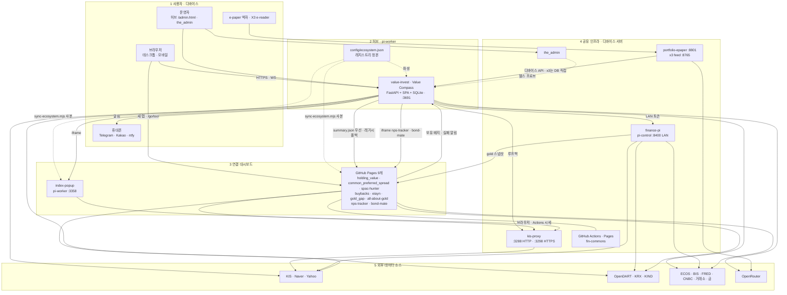
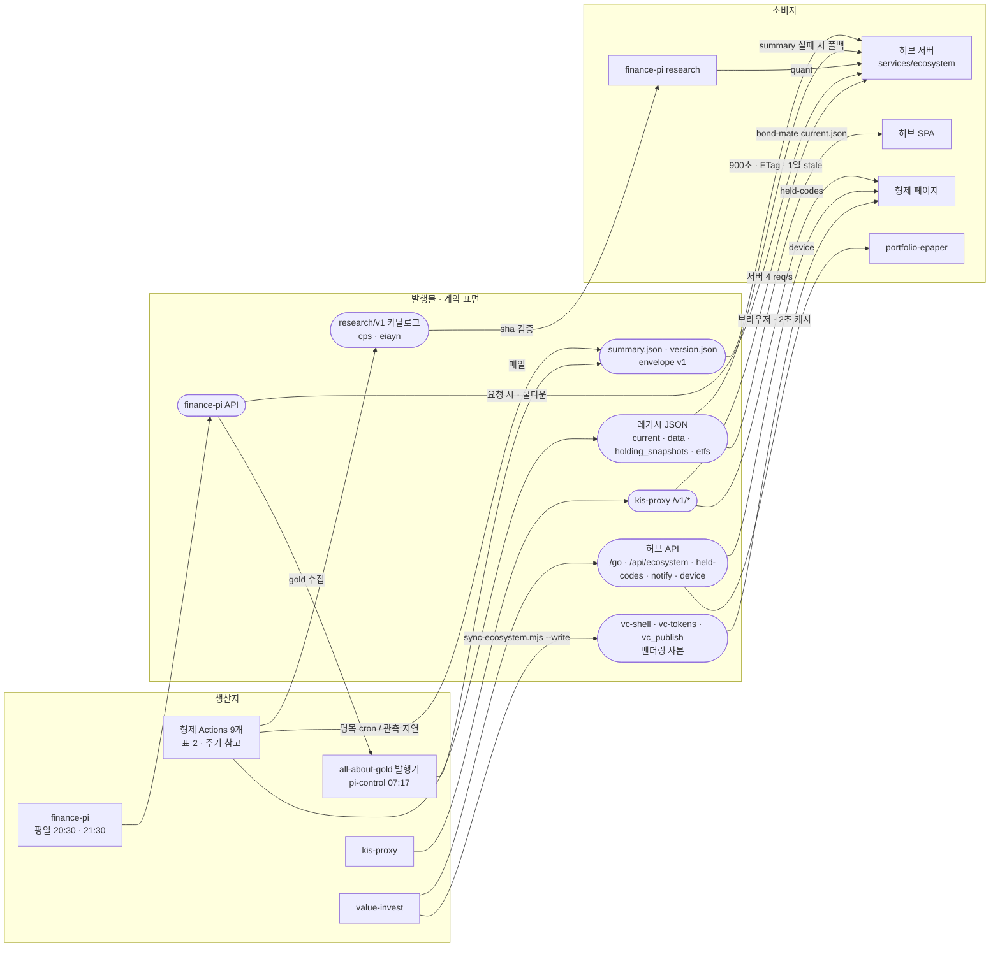

# 생태계 아키텍처

작성일: 2026-09-30 (브랜치 `ecosystem-2026-09`, 형제 저장소 `vc-ecosystem-2026-09` 기준)

이 문서는 Value Compass 생태계 전체 구조의 정본이다. 옛
[project-architecture-graph.md](../project-architecture-graph.md)(2026-06, 대시보드 4개만 반영)를 대체한다.
도구 목록·URL·딥링크 템플릿의 정본은 문서가 아니라 [config/ecosystem.json](../../config/ecosystem.json)이다.
여기 표와 레지스트리가 다르면 레지스트리가 맞다.

---

## 0. 한눈에 보기

- **허브 1개** — `value-invest`(Value Compass). FastAPI + 빌드 없는 SPA + SQLite `cache.db`, pi-worker `:3691`.
  포트폴리오 원장·NAV·종목 분석·알림·AI를 맡고, 생태계의 내비게이션·개인화 중심이다(레지스트리, `/go/{tool}`,
  보유 배지, 공용 알림 API, 디바이스 API).
- **연결 대시보드 9개(GitHub Pages)** — `holding_value`, `common_preferred_spread`, `spac-hunter`, `buybacks`, `eiayn`,
  `gold_gap`, `all-about-gold`, `nps-tracker`, `bond-mate`. "Actions가 곧 DB" 패턴: 배치가 JSON을 만들고 Pages가 공개한다.
  허브는 이 JSON을 **읽기만** 한다. 9개 모두 허브용 `summary.json`(공통 envelope)을 발행하도록 바뀌었다.
- **자체 호스팅 위젯** — `index-popup`(`:3358`, 허브가 iframe으로 임베드). 공용 셸을 채택한 10번째 형제다.
- **공유 인프라** — `kis-proxy`(`:3288` HTTP / `:3298` HTTPS), `finance-pi`(pi-control `:8400`, 데이터 레이크·리서치 API),
  `the_admin`(인프라 대시보드), `fin-commons`(pip 태그 라이브러리), GitHub Actions/Pages.
- **디바이스·주변부** — `portfolio-epaper`(`:8801`, 허브 디바이스 API 소비), `x3`(e-reader 브리핑 피드),
  `morning-bell`(Polymarket 브리핑, 허브와 런타임 연결 없음).
- 레지스트리 항목은 21개다. 공개 15개(허브 1 + 형제 10 + 허브 내부 화면 4)는 브라우저와 형제 저장소로 나가고,
  내부 6개(`finance-pi`, `kis-proxy`, `the_admin`, `portfolio-epaper`, `x3`, `morning-bell`)는 서버와 문서에서만 쓴다.

---

## 1. 계층 구조도

사용자·디바이스 → 허브 → 연결 대시보드 → 공유 인프라 → 외부 소스.

- 형제 → 허브 런타임 의존은 **장식 수준**뿐이다(보유 배지 스크립트, buybacks 실패 알림). 허브가 내려가도 형제
  페이지와 배치는 돈다. 반대로 **kis-proxy**는 형제 4개의 브라우저 실시간 시세와 index-popup 전체가 기대는 사실상의
  공유 런타임이다.
- 허브의 `/ws/quotes`는 kis-proxy를 거치지 않는다. `kis_ws_manager.py`가 허브 자체 KIS 앱키로 KIS 웹소켓에 직접 붙는다.
- `x3`는 아직 허브 DB를 SSH로 직접 읽는다([roadmap.md](roadmap.md) R-9에서 디바이스 API로 전환 제안).

### 호스트·포트

| 호스트 | 서비스(포트) | 공개 여부 |
|---|---|---|
| pi-worker | value-invest `:3691`(uvicorn 자체 TLS) · kis-proxy `:3288` HTTP + `:3298` HTTPS · index-popup(Caddy `:3358` → 내부 `:3359`) · nps-intraday 정적 JSON(Caddy `:3358/nps/`) · portfolio-epaper `:8801` · the_admin(Caddy `/admin/` → 내부 `:8790`) · value-invest 셀프호스트 러너 · nps-tracker 트리거 crontab | 3691·3298·3358·443은 `ducklove.duckdns.org`로 공개 |
| pi-control | finance-pi `:8400` · all-about-gold 발행 타이머 · x3 feed `:8765`(wlan0) · morning-bell 타이머 | LAN 전용 |
| GitHub Pages `ducklove.github.io/*` | 연결 대시보드 9개 | 공개 |

포트·호스트의 운영 정본은 the_admin `registry.yaml`이다(이번 작업에서 portfolio-epaper, x3-feed, nps-intraday,
finance-pi 타이머 등을 추가했다).

---

## 2. 데이터 흐름

발행물(둥근 노드)이 계약 표면이다. 형제별 주기는 아래 표에 명목 cron과 관측값을 함께 적었다. 관측값은 분석 시점
(2026-09 하순) `gh run list` 기준이며, GitHub 스케줄러 지연 때문에 명목과 크게 다르다.

형제별 명목 cron과 관측 주기(분석 시점 `gh run list`):

| 형제 | 명목 | 관측 |
|---|---|---|
| holding_value `update-current` | 평일 10분 | 하루 5~7회(3~6시간 간격) |
| common_preferred_spread `update-current` | 평일 30분 슬롯 | 하루 6~7회 |
| spac-hunter `pages.yml` | 15:30 KST | 20:40~23:20 KST |
| buybacks | 05:30 KST 일간 · 월 1회 전수 | 정상 |
| eiayn `fetch-data` | 평일 15:35 KST | 20:40~23:20 KST(summary는 Pages 빌드 때) |
| gold_gap `update-data` | 30분 | 3~7시간 간격 |
| nps-tracker | Pi crontab 평일 15:45 dispatch | 정상 |
| bond-mate `update-data` | 5분(FX)·30분(금리) | 하루 6~10회 |
| all-about-gold | pi-control 07:17 | 정상 |

### 허브 내부 배치(KST)

| 시각 | 작업 | 트리거 |
|---|---|---|
| 03:30 | cache.db 백업 | `value-invest-backup.timer` |
| 04:30 | 증권사 리포트 위키 수집 | `wiki-ingestion.timer` |
| 05:10 / 12:10 / 18:10 | DART 정기보고서 AI 리뷰 | `dart-review-ingestion.timer` |
| 07:00 / 07:30 평일 | 밸류에이션 브리핑 / 아침 브리핑 | `daily-briefing-valuation`, `daily-briefing` |
| 08:00~19:50(10분) + 20:00 | 인트라데이 스냅샷(사용자 간 시세 공유 맵) | `portfolio-intraday.timer` |
| 5분 / 10분 상시 | 가격·공시·리포트 알림 / 경제캘린더 알림 | `notify-alerts`, `notify-calendar` |
| 15:35~16:45 평일(재시도 슬롯) | 정규장 종가 NAV 정산 | `portfolio-snapshot.timer` |
| 15:43 / 16:43 / 20:30 | 데이터 품질 점검(수능일·휴장일 커버리지 포함) | `data-quality.timer` |
| 15:45·16:45 / 20:40 평일 | 장마감 / 야간 브리핑 | `daily-briefing-market-close`, `-night` |
| 20:05, 10:00 평일 | 장후 처리 | `portfolio-after-close.timer` |
| 매시 :05 | 형제 데이터 파일 동기화(`gold_gap`은 `origin/data`) | `linked-projects-sync.timer` |

타이머는 모두 `curl -fsSk https://127.0.0.1:3691/api/internal/...`(백업·동기화는 셸 스크립트)이고, 실패하면
`value-invest-notify@.service`가 ntfy로 알린다. 형제 쪽 주요 타이머: finance-pi `finance-pi-daily.timer`(평일 20:30/21:30),
all-about-gold `all-about-gold-update.timer`(07:17), nps-tracker 트리거 crontab(평일 15:45), morning-bell(08:07).

---

## 3. 호스팅·배포

| 프로젝트 | 호스팅 | 주소 | 배포 트리거 | 스케줄 |
|---|---|---|---|---|
| **value-invest** | pi-worker systemd | `https://ducklove.duckdns.org:3691` | **master push = 배포**: self-hosted 러너가 `deploy/deploy.sh`(ruff→pytest→npm test→재시작→healthz, 실패 시 롤백) | 타이머 14개(위 표) |
| holding_value | Pages(브랜치 빌드, master 루트) | `ducklove.github.io/holding_value` | master push | `update-current` `2/10 * * * 1-5` · `update-data` `0 20 * * *`(UTC) · `update-fundamentals` 주 1회 |
| common_preferred_spread | Pages(브랜치 빌드) | `…/common_preferred_spread` | master push | `update-current` 평일 슬롯(`3,33 0-6`, `3,33 12-20` UTC 등) · `update-data` `13 20 * * *` |
| spac-hunter | Pages via Actions(`path: .`) | `…/spac-hunter` | main push | `pages.yml` `30 6 * * *` UTC |
| buybacks | Pages via Actions(Vite) | `…/buybacks` | master push(`deploy-pages.yml`) | `update-buybacks-data` 05:30 KST · `refresh-holdings` 매월 2일 04:30 KST |
| eiayn | Pages via Actions(Vite) | `…/eiayn` | main push | `fetch-data` `35 6 * * 1-5` UTC → Pages 배포 dispatch |
| gold_gap | Pages via Actions | `…/gold_gap` | master push(`deploy.yml`) | `update-data` `*/30` → orphan `data` 브랜치 → 배포 |
| all-about-gold | Pages via Actions | `…/all-about-gold` | main 또는 `data` push | pi-control `all-about-gold-update.timer` 07:17 → finance-pi 수집 → `data` 브랜치 push |
| nps-tracker | Pages via Actions(`_site` 허용 목록) | `…/nps-tracker` | main push | pi-worker crontab 평일 15:45 → `gh workflow run pages.yml` |
| bond-mate | Pages via Actions | `…/bond-mate` | master push(`deploy.yml`) | `update-data` `5,35 * * * *` · `2-57/5`(FX) · `10 2 * * *` → `data` 브랜치 → 배포 |
| index-popup | pi-worker systemd + Caddy | `https://ducklove.duckdns.org:3358` | **수동** pull + `npm ci` + build + restart(CI 없음) | 요청 구동 |
| kis-proxy | pi-worker systemd `--user` | `:3288` / `:3298` | **수동** git pull + restart(CI 없음) | 프로세스 내 지수 인트라데이 수집 |
| finance-pi | pi-control systemd `--user` | LAN `:8400` | **수동** `bash ops/deploy.sh`(push는 CI만) | daily 평일 20:30/21:30 · watchdog 1분 · 백업 주 1회 |
| the_admin | pi-worker systemd + Caddy basic auth | `/admin/` | **수동** pull + restart | 상태 프로브 백그라운드 30초 |
| portfolio-epaper | pi-worker systemd | LAN `:8801` | **수동** | 디바이스가 08~24시 30분마다 깨어남 |
| x3 | pi-control systemd `--user` | LAN `:8765` | 수동 복사 · 펌웨어 USB | 브리핑 게시 수동 |
| morning-bell | pi-control systemd `--user` | — | origin/main pull 기반 자동 배포(2분) | 08:07 브리핑 |
| fin-commons | pip git 태그 | github.com/ducklove/fin-commons | 태그 릴리스 | — |

형제 저장소는 push가 곧 Pages 배포다. 이번 작업의 형제 변경은 모두 `vc-ecosystem-2026-09` 브랜치에 커밋만 되어 있다.
배포 순서와 수동 배포 목록은 [roadmap.md §0](roadmap.md#0-지금-필요한-소유자-조치)에 있다.

---

## 4. 통합 계약

### 4-1. 레지스트리와 파생물

[config/ecosystem.json](../../config/ecosystem.json)이 도구 목록·URL·링크 템플릿·데이터 URL·벤더링 경로의 유일한 정본이다.

| 파생물 | 만드는 곳 | 검증 |
|---|---|---|
| `services.ecosystem.integrations.DEFAULT_BASE_URLS`(env override 유지) | [core/ecosystem.py](../../core/ecosystem.py) `default_base_urls()` | `tests/test_ecosystem_registry.py` |
| handoff 허용 목록(`/api/portfolio/open/{key}`, `/go`) | `core.ecosystem.handoff_keys()` | 같은 테스트 |
| `/app-config.js`의 `APP_CONFIG.ecosystem`, `/api/ecosystem` | `core.ecosystem.public_projection()`(공개 항목만) | 같은 테스트 |
| `static/ecosystem/vc-shell.js` 인라인 레지스트리 블록 | `scripts/sync-ecosystem.mjs`(같은 투영 규칙) | pytest가 `sync-ecosystem.mjs --hub-only` 실행 |
| 형제 저장소 벤더링 사본 | `node scripts/sync-ecosystem.mjs --write` | 같은 스크립트의 verify 모드(기본) |
| 형제 JSON URL(`data[]`) | `services/ecosystem/external_tools.py`, `siblings.py` | `tests/test_external_tools.py` 등 |

내부 항목(`visibility: "internal"`)은 브라우저 투영과 벤더링 파일에서 빠진다. 공개 항목에 사설 IP나 내부 포트
(3288·8400·8765·8790·8801)가 들어가면 로더와 동기화 스크립트가 모두 거부한다.

### 4-2. 딥링크·임베드

상세 규칙은 [ui-contract.md](ui-contract.md)가 정본이다. 요약:

| 방향 | 형태 | 비고 |
|---|---|---|
| 허브 → 형제 | `/go/{tool}?code=&view=&asset=&theme=&embed=` → 303 | 레지스트리 템플릿과 `accepts` 정규식으로만 목적지를 만든다 |
| 허브 → handoff 도구 5개 | 같은 `/go`(또는 별칭 `/api/portfolio/open/{key}`) → `?code|stock=&theme=#vc-held=CODE:QTY,…` | holding_value·cps·spac-hunter·buybacks·eiayn |
| 형제 → 허브 | `VCShell.hubAnalysisUrl(code)` → `/analysis?code=…&theme=…&from=<tool>` | 허브가 `?from` 돌아가기 칩을 그린다 |
| 형제 ↔ 형제 | `VCShell.linkTo(id, {code|view|asset})` | 허브를 거치지 않는다(독립 배포) |
| 허브 iframe | nps-tracker `?embed=1`, bond-mate `?embed=<tab>`, index-popup `?headless=1` | `vc:ready` 이후 테마는 postMessage |

### 4-3. 발행 데이터

형제 → 허브 데이터는 [data-contract.md](data-contract.md)의 envelope v1 `summary.json`이 1순위이고, 없거나
계약을 어기면 도구별로 레거시 파일로 폴백한다([services/ecosystem/siblings.py](../../services/ecosystem/siblings.py)).

| 도구 | summary.json 위치 | 현재 상태(2026-09-30) | 허브가 폴백으로 읽는 레거시 파일 |
|---|---|---|---|
| holding_value | master 루트 | 초기 파일 커밋됨, `update-current.yml`이 갱신 | `current.json`, `config.json`(raw), `api/holdings.json`(브라우저) |
| common_preferred_spread | master 루트 | 초기 파일 커밋됨, `update-current.yml` | `current.json`, `config.json`(raw) |
| spac-hunter | main 루트 | 초기 파일 커밋됨, `pages.yml` | `current.json`, `data.json`(raw) |
| buybacks | `public/` → dist 루트 | 초기 파일 커밋됨, 데이터 워크플로 3종 | `data/buybacks/holding_snapshots.json` |
| eiayn | `dist/`(빌드 산출물) | `npm run build`에서 생성, 커밋하지 않음 | `data/etfs.json`(universe만), `data/rankings.json` |
| gold_gap | `data` 브랜치 → `_site` | 머지 후 다음 `update-data` 실행에서 생성 | `data.json`(Pages) |
| all-about-gold | `_site`(빌드 산출물) | `build_pages.py`가 생성, 점검용 사본 `data/summary.json` 커밋 | 없음(summary 전용) |
| nps-tracker | main 루트 → `_site` 허용 목록 | 초기 파일 커밋됨 | `current.json`(raw) |
| bond-mate | `data` 브랜치 → `_site` | 다음 `update-data` 실행에서 생성, 없으면 `deploy.yml`이 `current.json`에서 빌드 | `data/current.json` |

그 밖의 흐름:

- **research v1 카탈로그**: cps·eiayn이 `data/research/v1/{manifest,snapshots/<sha>}.json`을 발행하고 finance-pi
  `research/catalogs.py`가 sha 검증 후 소비(매니페스트 5분 메모리 캐시). 허브 quant는 finance-pi를 통해 쓴다.
- **finance-pi → all-about-gold**: pi-control 타이머가 finance-pi gold 수집을 돌리고 all-about-gold `data` 브랜치에 push.
  finance-pi는 내용 지문이 같으면 새 릴리스를 만들지 않는다.
- 허브 브라우저는 bond-mate `data/current.json`을 직접 읽어 지표 카탈로그에 병합한다(서버 summary와 별개).

### 4-4. 서버 API

| API | 제공 | 인증 | 소비자 |
|---|---|---|---|
| `GET /go/{tool_id}` | 허브 [routes/ecosystem.py](../../routes/ecosystem.py) | 없음(handoff 도구는 세션이 있으면 보유 스냅샷 첨부) | 허브 SPA 링크, labs '연결 대시보드' |
| `GET /api/ecosystem` | 허브 | 없음, `max-age=60` | 공개 레지스트리 투영 + 형제별 신선도(`asOf`) |
| `GET /app-config.js`, `/api/integrations` | 허브 | 없음 | 허브 SPA(`APP_CONFIG.integrations`·`.ecosystem`). kisProxy는 빠졌다 |
| `GET /api/portfolio/held-codes` | 허브 | 세션 쿠키(credentialed CORS) | `portfolio-held-badges.js`(형제 5개) |
| `GET /api/portfolio/open/{key}` | 허브 | 세션 | `/go` handoff 경로의 별칭 |
| `POST /api/internal/notify` | 허브 | 루프백 직접 연결 **또는** `X-Internal-Token` | buybacks 워크플로 4종(실패 알림) |
| `/api/internal/*`(스냅샷·알림·품질·브리핑·인제스트) | 허브 | 같은 규칙 | 허브 systemd 타이머 |
| `GET /api/device/portfolio` | 허브 | `X-Device-Token`(`DEVICE_API_TOKEN`) | portfolio-epaper |
| `POST /api/asset-quotes`, `GET /api/asset-quote/{code}` | 허브 | 없음 | 허브 SPA(형제 사용처 없음) |
| `/v1/stocks/*`, `/v1/indexes/*`, `/v1/futures/kospi-night/*`, `/v1/overseas/*`, `/v1/naverfinance/*`, `/v1/yfinance/*` | kis-proxy | 선택 `X-KIS-Proxy-Token`, 클라이언트 IP당 분당 120회(기본) | 허브 서버, 형제 Actions·브라우저, index-popup |
| `/api/prices/*`, `/api/macro/*`, `/api/fundamentals/*`, `/api/research/*`, `/api/ready` | finance-pi | `X-Admin-Token`(사설망 GET은 생략 가능) | 허브, cps·holding_value(LAN 실행 때), bond-mate, all-about-gold 발행기 |
| `GET /api/device/dashboard` | the_admin | `X-Device-Token` | portfolio-epaper |
| `GET /api/widget-data` | index-popup | 없음 | index-popup SPA |

내부 API 인증: 토큰이 맞거나, 프록시 헤더(`X-Forwarded-For`·`X-Real-IP`·`Forwarded`) 없는 루프백 직접 연결이면
통과한다. `INTERNAL_API_TOKEN`을 설정해도 로컬 타이머는 계속 동작한다([routes/internal.py](../../routes/internal.py)).

### 4-5. 공유 자산과 배포 방식

| 자산 | 정본 | 배포 | 사용처 |
|---|---|---|---|
| `vc-shell.js` v1.1.0(`<vc-shell>` + `window.VCShell`) | [static/ecosystem/vc-shell.js](../../static/ecosystem/vc-shell.js) | `sync-ecosystem.mjs --write`로 바이트 동일 복사(레지스트리 `vendor.dir`) | 허브(`variant="menu"`) + 형제 10개 |
| `vc-tokens.css`(`--vc-*`) | [static/ecosystem/vc-tokens.css](../../static/ecosystem/vc-tokens.css) | 같은 스크립트 | 허브 + 형제 10개 |
| theme-boot 인라인 블록 | [static/ecosystem/vc-theme-boot.js](../../static/ecosystem/vc-theme-boot.js) | `<!-- vc:theme-boot -->` 마커 사이에 인라인 주입·바이트 검증 | 허브 `index.html` + 형제 10개 |
| `vc_publish.py` / `vc-publish.mjs` | [ecosystem/python](../../ecosystem/python/vc_publish.py), [ecosystem/js](../../ecosystem/js/vc-publish.mjs) | 같은 스크립트(`vendor.python`/`vendor.js`) | 형제 9개 |
| `portfolio-held-badges.js` | [static/js/portfolio-held-badges.js](../../static/js/portfolio-held-badges.js) | 허브에서 **핫링크**(`?v=` = 레지스트리 `heldBadges.version`, 현재 `20260930-vc`) | holding_value, cps, spac-hunter, buybacks, eiayn |
| `analytics.js`(GA4) | [static/js/analytics.js](../../static/js/analytics.js) | `scripts/sync-analytics.mjs --write`(목록 `config/analytics-projects.json`, 레지스트리와 일관성 검사) | 허브 + 형제 10개 |
| fin-commons | 별도 저장소 | pip git 태그(`@v0.2.0`) | holding_value, cps, spac-hunter, nps-tracker |

`sync-ecosystem.mjs`는 작업 트리에만 쓰고 git은 실행하지 않는다. 형제 체크아웃은 `--workspace`(기본 `..`) 아래
**도구 id와 같은 디렉터리 이름**으로 찾는다. 검증 항목: 벤더링 파일 바이트 동일성, theme-boot 블록, `<vc-shell>` 채택,
`vc-shell.js`/`vc-tokens.css`의 `?v=` 라벨 = `VCShell.version`, 보유 배지 `?v=` = 레지스트리 버전, 발행 헬퍼 사본.

### 4-6. 허브 admin의 형제 config 쓰기

| 대상 | 경로 | 주의 |
|---|---|---|
| holding_value · cps · gold_gap `config.json` | `/admin.html` → `PUT /api/admin/linked-project-configs/{key}` → [services/ecosystem/linked_admin.py](../../services/ecosystem/linked_admin.py) | 스키마 검증 후 **Pi 로컬 체크아웃에만** 원자적으로 쓴다. GitHub로 push하지 않는다. 형제 Actions는 커밋된 `config.json`을 읽으므로 허브 편집은 형제 데이터에 반영되지 않는다(형제 자체 `admin.html`과도 경합). `linked-projects-sync`는 `config.json`을 덮어쓰지 않는다 |

---

## 5. 옛 문서와 달라진 점

[project-architecture-graph.md](../project-architecture-graph.md)(2026-06)의 정정:

1. 대시보드 4개만 있었다. buybacks, eiayn, nps-tracker, bond-mate, all-about-gold, index-popup과 portfolio-epaper, x3, the_admin, fin-commons가 빠져 있었다.
2. `WS → kis-proxy` 간선은 틀렸다. 허브 `/ws/quotes`는 KIS에 직접 붙는다.
3. `holding_value → kis-proxy 시세 history`는 틀렸다. quote·지수 quote(Actions)와 네이버 배치 시세(브라우저)를 쓴다.
4. 외부 인사이트가 전부 raw.githubusercontent라고 적혀 있었다. 지금 URL은 레지스트리 `data[]`에서 오고, summary.json(Pages)이 1순위다.
5. finance-pi는 "종가 백업"만이 아니다. 포트폴리오 히스토리·매크로 벤치마크·스크리너·quant 리서치의 원천이다.
6. systemd 타이머는 4개가 아니라 14개다.
7. 허브가 형제에게 **제공**하는 표면(보유 배지, `held-codes`, `/go`, `/api/internal/notify`, `/api/device/portfolio`, `/login?return_to`, 공용 셸)이 없었다.
8. admin의 형제 config 편집이 로컬 체크아웃에만 쓰인다는 점이 없었다.

## 관련 문서

- [README.md](README.md) — 생태계 문서 색인
- [ui-contract.md](ui-contract.md) — 딥링크·테마·셸·iframe 계약
- [data-contract.md](data-contract.md) — summary.json 발행 계약
- [external-data.md](external-data.md) — 외부 데이터 소스와 캐시
- [../linked-projects.md](../linked-projects.md) — 환경변수·운영 메모
