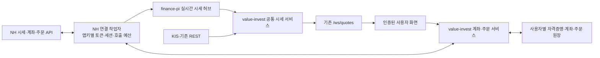

# NH 나무 API 활용·실시간 시세·계좌 연동 설계

작성: 2026-09-15. 상태: **다중 계좌·NH 조회 연동·국내 실시간 시세 구현**.
실제 동작과 운영 절차는 [계좌 관리·NH 연동 안내](portfolio-accounts.md)를 기준으로 한다.
이 문서의 장기 구조·주문·체결 통보·finance-pi 통합은 후속 설계다. 조사 당시 코드: value-invest `cba357df`, finance-pi `296e593`.

## 1. 권장 방향

1. **NH 통합 체결가 웹소켓으로 주요 보유종목 시세부터 보강한다.** KIS와 시장·체결시각을 맞춰 비교하고, 장애 시 신선한 공급원으로 전환한다.
2. **증권사 연결은 서버에서 앱키별로 한 곳이 소유한다.** 화면·탭마다 연결을 만들지 않는다. 시세·계좌·주문이 같은 키의 연결 수와 호출 예산을 함께 사용한다.
3. **사용자별 계좌 연동은 조회부터 시작한다.** 최초 잔고 가져오기는 초기 등록이며, 이후 실제 체결만 수량·현금에 반영한다.
4. **자동매매는 계좌별 기록과 실제 주문·체결 처리가 완성된 뒤 도입한다.** 기존 수동 매매 기록 API와 실제 주문 전송 API를 구분한다.

공식 API에 필요한 시세·잔고·주문·통보 기능이 있다. 다만 공개 문서가 설명하는 기능과 사용자 키의 실제 사용 권한은 별도로 검증해야 한다. [공식 API 안내](https://www.nhplug.com/), [국내주식 명세](https://www.nhplug.com/openapi-docs/krstock/openapi.json).

## 2. 구현 전 조사에서 확인한 상태

| 대상 | 확인 결과 | 도입 시 작업 |
| --- | --- | --- |
| finance-pi 설정 | `config.py`의 `KNOWN_DOTENV_KEYS`·`RuntimeSettings`에 `NAMUH_*` 없음 | 허용 설정명, 비밀 필드, 시작 시 검증 추가. 환경에 값이 있어도 현재 NH 소비 코드는 없음 |
| 설정 파일 | 로컬 및 확인한 운영 경로 `/home/cantabile/Works/finance-pi/.env`에서 두 키의 비어 있지 않은 값을 확인하지 못함 | 사용자가 입력한 설정 화면/실제 저장 경로 확인. 값은 출력하지 않음 |
| value-invest 설정 | 로컬 `.env`에 `NAMUH_ACCOUNT_ID`의 비어 있지 않은 값 존재 확인 | 연결된 앱키의 계좌목록과 일치 확인 후 소유 사용자에게만 연결 |
| 현재 웹소켓 | `routes/ws_quotes.py`가 브라우저 세션에 KIS 키 슬롯을 할당. `kis_ws_manager.py`의 연결당 구독 한도 40 | 서버가 종목별 중복 구독을 합치고 여러 클라이언트로 전달하도록 변경 |
| 공통 시세 | `services/stock_quotes.py`가 캐시·KIS WS·REST·최종 시세 반환을 담당 | NH 어댑터와 공급원 선택을 여기로 모음 |
| 계좌 모델 | `portfolio_accounts` 및 보유 행의 `account_id`는 있으나 보유 PK는 `(google_sub, stock_code)` | 같은 종목을 여러 계좌에 보유할 수 있도록 키·조회·수정 계약 변경 |
| 수동 매매 | `repositories/portfolio_trades.py`는 사용자 단위 종목과 `CASH_{통화}`를 원자적으로 갱신 | 계좌별 현금 격리. 연결계좌의 체결 처리는 별도 경로로 구현 |
| finance-pi 서버 | `admin/server.py`는 `BoundedThreadingHTTPServer`, 일봉·분석 작업과 같은 프로젝트 | 장시간 WS 연결은 별도 비동기 프로세스로 운영 |

이번 조사에서는 토큰 발급, 계좌 조회, 실시간 틱 수신, 주문 호출을 수행하지 않았다. 설정 존재 확인은 인증 성공 증명이 아니다.

## 3. 공식 프로토콜과 확인이 필요한 차이

| 용도 | 공식 인터페이스 | 적용 |
| --- | --- | --- |
| 국내 시세 | `wss://api.nhplug.com:7070/websocket` | `mc` 통합 체결가부터, 주문 화면에는 필요한 종목의 `mb` 호가 추가 |
| 시장 구분 | `oc` KRX / `nc` NXT / `mc` 통합 | NH `UNT`와 KIS `UN`을 내부 `integrated`로 매핑 |
| 해외 시세 | `wss://api.nhplug.com:7080/websocket`, `RC`/`RH` | `rc`/`rh`는 지연 채널. 대소문자 유지, GIC 15자리 종목키를 마스터에서 매핑 |
| 주문·체결 통보 | 국내 `d3`/`d2`, 해외 `d1`/`d0`, 모두 7070 | 시세와 다른 사용자 전용 이벤트 경로 |
| REST | `https://api.nhplug.com:8443` | 시세 조회, 초기 잔고, 통보 유실 복구에 사용 |
| 인증 | `POST /oauth2/token`, 토큰 유효기간 24시간 | 만료시각을 저장해 재사용. 모의투자 인증도 운영 호스트 사용 |
| 계좌 목록 | `POST /n2/acctinfo` | `acct_no`를 잔고·주문의 `act_no`로 사용. `acct_type` 01·02 운영, 03 모의 구분 |

근거: [실시간 채널 문서](https://github.com/PLUG-OpenAPI/nhplug-sdk/blob/main/docs/realtime_channels.md), [공통 명세](https://www.nhplug.com/openapi-docs/common/openapi.json), [해외주식 명세](https://www.nhplug.com/openapi-docs/gbstock/openapi.json).

### 웹소켓 한도는 문서 간 불일치

- SDK·채널 안내: 앱키당 동시 2세션, 세션당 10등록, 등록 전송 초당 10건.
- 포털 OpenAPI의 `x-rate-limits`와 `llms-full.txt`: 동시 2채널, 채널당 최대 30건.
- **이번 구현은 앱키당 1세션, 기본 30등록**을 사용한다. `NAMUH_WS_MAX_REGISTRATIONS`로 1~30 사이에서 조정할 수 있다. 두 번째 세션을 자동으로 만들지 않으며 초과 종목은 기존 시세 경로를 사용한다. 등록은 `(채널, 구독키)` 단위이며 실제 적용 한도는 키로 검증해야 한다.
- NH에 한도 적용 기준을 확인한 뒤 설정을 조정한다. 운영 계좌 연결을 끊어 가며 한계를 시험하지 않는다.

근거: [SDK 한도 구현](https://github.com/PLUG-OpenAPI/nhplug-sdk/blob/main/nhplug/realtime.py), [포털 공통 명세의 한도](https://www.nhplug.com/openapi-docs/common/openapi.json).

구독 요청은 `header.token`, `header.tr_type=1`, `body.tr_cd`, `body.tr_key`를 보내며 해제는 `tr_type=2`다. 등록 응답과 실제 데이터 푸시를 구분한다. 메시지는 JSON이며 KIS의 구분자 파서·통보 복호화 로직을 재사용하지 않는다. 전송은 TLS로 보호한다. 명세상 별도 heartbeat는 불필요하므로 KIS heartbeat를 복사하지 않는다. [프로토콜 정본](https://www.nhplug.com/openapi-docs/krstock/openapi.json).

## 4. 실행 구조



- **NH 연결 작업자**: finance-pi의 일봉 작업과 분리한 비동기 서비스. 초기에는 시세 기능만 연다. 같은 앱키의 토큰·세션 소유자는 전체 프로세스에서 하나여야 한다. 추후 계좌 호출도 이 연결 소유자를 통한다.
- **finance-pi 시세 허브**: 최신 시세와 수신 상태를 서비스하고, 필요한 집계만 일괄 저장한다. 모든 틱에 Parquet 쓰기나 DuckDB 조회를 실행하지 않는다. 일봉 수집·Gold 생성 장애와 실시간 상태를 분리한다.
- **value-invest**: 사용자 인증, 계좌 소유권, 비밀 저장, 동기화 의미, 주문 정책과 감사 원장의 책임을 가진다. 연결 작업자는 승인된 요청만 실행하는 프로토콜 어댑터다.
- **내부 통신**: 같은 서버에서는 권한을 제한한 Unix 소켓, 서버가 나뉘면 TLS 및 서비스 인증을 사용한다. 시세용 자격증명으로 계좌·주문 RPC를 호출할 수 없게 권한을 구분한다.
- **SDK 사용 방식**: 공식 SDK의 전역 환경변수·토큰 캐시·프로세스 내부 세마포어를 다중 사용자 격리 수단으로 사용하지 않는다. 요청마다 `os.environ`을 바꾸지 않고, `credential_id`와 자격증명을 주입받는 인스턴스 어댑터를 둔다.
- **초기 규모**: Pi 한 대, 활성 사용자 수·종목 수는 아직 미측정. 우선 별도 메시지 브로커 없이 크기를 제한한 큐와 최신값 캐시를 사용한다. 사용자 증가 시 연결 작업자를 자격증명별로 분할한다.

이 구조는 별도 프로세스와 내부 API가 추가되는 비용이 있다. 대신 일봉 작업이나 브라우저 재접속이 증권사 연결을 흔들지 않고, 동일 앱키를 finance-pi와 value-invest가 경쟁해서 사용하는 문제를 예방한다.

### 설정과 자격증명

- 기존 이름 `NAMUH_APP_KEY`, `NAMUH_APP_SECRET`, `NAMUH_ACCOUNT_ID`를 유지하고 어댑터 안에서 NH 필드로 매핑한다. SDK의 `NHPLUG_*` 이름으로 사용자의 설정을 임의 변경하지 않는다.
- 현재 공용 설정 키는 관리자의 시세 연결을 시작하는 용도다. 다중 사용자 단계에서는 사용자별 `broker_credentials`로 등록하고 연결 작업자가 참조 ID로 사용한다. 한 앱키를 중복 등록하면 새 연결을 만들지 않고 소유권 확인 후 기존 런타임에 연결한다.
- 계좌번호 환경변수만으로 소유 사용자를 추정하지 않는다. 로그인한 사용자가 등록한 키로 받은 계좌목록에서 확인한 계좌만 연결한다. `NAMUH_ACCOUNT_ID`는 해당 소유자의 최초 선택값이다.
- 비밀은 서버에서 인증 암호화로 저장하고 암호화 키는 DB·백업과 분리한다. 브라우저 저장소·응답·오류 로그에 키/시크릿/토큰/계좌번호 원문을 남기지 않는다. 인증 요청의 URL 쿼리에도 비밀이 들어가므로 HTTP 예외 로그를 반드시 정제한다.
- 토큰은 자격증명·인증 호스트별로 접근이 제한된 영속 캐시에 저장하고, 발급 잠금과 원자적 교체를 적용한다. 만료 또는 인증 실패 시 갱신하며 유량 초과로 재발급하지 않는다. 세션 소유권도 프로세스 전체에 걸친 임대로 관리한다.
- REST는 공식 안내의 초당 약 5회 범위에 맞춰 앱키 전체에 기본 4회/초 제한을 둔다. 시세·계좌·주문에 각각 4회씩 허용하는 방식이 아니다. 미체결 확인·주문 처리를 위한 여유를 확보하고 조회가 밀리면 화면 갱신 빈도를 낮춘다. [REST 호출 구현](https://github.com/PLUG-OpenAPI/nhplug-sdk/blob/main/nhplug/client.py).
- P0에서 Pi의 TLS 인증서 체인 검증도 확인한다. 공식 문서가 중간 인증서 문제를 언급하므로 신뢰 저장소를 올바르게 구성하며, 인증서 검증을 끄는 우회는 사용하지 않는다.

## 5. 실시간 시세를 실제로 보강하는 방법

### 구독 배분

1. 미체결 주문 관련 체결·주문 통보 및 주문 대상 종목을 우선한다.
2. 활성 포트폴리오에서 KIS가 맡지 못하거나 오래된 시세를 가진 종목을 배정한다.
3. 주요 보유종목 일부는 KIS와 NH를 함께 구독해 공급원 차이를 관찰한다.
4. 잔여 예산으로 분석 화면을 처리한다. 호가는 주문 화면에서만 추가한다.
5. 각 `(credential_id, endpoint, channel, key)`를 한 번 구독하고 참조 수를 관리한다. 화면 이동의 짧은 해제 지연으로 반복 등록을 줄인다. 용량 초과분은 REST 보강 대상으로 명시한다.

예: 국내 시세 1세션에 `mc` 8종목 + 국내 통보 `d2`, `d3`를 배치하는 보수적인 예산을 둘 수 있다. 해외 시세를 켜면 7080에 두 번째 세션이 필요하므로 국내 20종목과 해외 10종목을 동시에 가능하다고 표시하면 안 된다. 실제 혼합 채널·통보 등록 계산은 P0 검증에서 확인한다.

### 공급원 선택과 시각

현재 `source` 문자열의 `ws` 포함 여부만으로 높은 우선순위를 부여하는 규칙을 확장한다. 최소 계약은 다음과 같다.

```text
instrument_id, currency, venue(KRX/NXT/integrated), market_session,
provider(kis/namuh/naver), transport(ws/rest), channel,
price, previous_close, change_basis, trade_value,
trade_at, received_at, market_date,
freshness(live/delayed/stale/unknown), delay_seconds, stale_reason
```

- 같은 종목·통화·시장·거래일·평가 기준에서만 신선도를 비교한다. 최근에 받은 과거 틱이 새 틱을 덮지 않도록 `trade_at`과 `received_at`을 구분한다.
- NH `mc`의 `time`은 시각만 있으므로 거래일·세션과 결합한다. 연결 복구 직후 오래된 시세를 수신했다고 당일 실시간으로 단정하지 않는다. 날짜를 확정할 수 없으면 REST로 기준을 잡는다.
- 정규장 종가 `main_close`, 전일 대비, 정규장 대비 등락은 별도 의미다. 전체장 시세를 정규장 값으로 덮거나 `main_close`를 전일 종가로 사용하지 않는다. `value`와 `value_won` 단위도 구분한다.
- 초기에는 NH 결과를 별도 캐시에 받아 KIS와 비교한 뒤 화면 반영을 켠다. 이후 조건을 만족하는 최신 틱을 선택한다. 공급원 간 가격을 평균 내지 않는다.
- REST는 새로운 기준을 확보하는 데 사용한다. WS 보호 시간을 무기한 두지 않으며, 지연 해외 시세를 `ws`라는 이유만으로 실시간으로 승격하지 않는다.
- **주문 판단용 시세는 별도 기준**을 둔다. 오래된 가격·불명확한 시장·검증되지 않은 지연 시세로 신규 주문을 만들지 않는다. 표시 가능한 최종 시세와 주문 가능한 시세는 다르다.

화면에는 공급원, 체결시각, 지연/최종 시세 상태를 보여준다. 앱키 슬롯·프로토콜 코드 같은 운영 세부사항은 관리 화면으로 보낸다.

### 재접속·성능·관측

- 연결 실패는 지수 백오프와 무작위 지연으로 재시도한다. 구독 희망 목록에서 중복을 제거해 재등록하고 ACK와 첫 실제 틱을 각각 확인한다. `WSS10015`를 만나면 다른 세션을 강제 해제하지 않는다.
- 시세는 느린 소비자에게 종목별 최신값만 합쳐 전송한다. 시작 목표는 화면 반영 간격 100~250ms, 수신 후 화면까지 p95 1초 이내이며 실제 Pi 측정으로 조정한다. 거래소에서 우리 서버까지의 보장 지연시간이라는 뜻은 아니다.
- 주문 통보는 버리거나 합치지 않는다. 영속 수신함에 기록한 후 처리하며, 연결 누락은 REST 주문·체결 조회로 복구한다.
- 상태 항목: 연결 수, 희망/승인 구독 수, 실제 틱 수, 마지막 수신시각, 종목별 체결시각, 누락/역행 틱, 큐 길이, 재접속, REST 유량, 인증 실패. 시장 폐장·휴장·저유동성을 고려해 무체결과 장애를 구분한다.
- 실시간 준비 상태를 일봉 `/api/ready`와 별도 제공한다. 연결 성공이나 구독 ACK만으로 `live=true`를 반환하지 않는다.

## 6. 사용자별 계좌 연동과 포트폴리오 의미

### 사용자 흐름

`설정 → 증권사 연결 → 나무 → 앱키·시크릿 등록 → 조회 가능한 계좌 선택 → 보유종목·통화별 현금 미리보기 → 연동`

처음에는 조회 연동이 기본이다. 증권사 잔고와 기존 수동 등록이 겹치면 사용자가 대상 계좌를 선택하고 차이를 검토한다. 기존 수동 잔고에 증권사 잔고를 단순 합산하지 않는다.

| 작업 | 수량·현금 반영 | 사용자 동작 |
| --- | --- | --- |
| 수동 초기 등록 | 입력한 잔고를 설정, 현금 차감 없음 | 초기 등록 |
| 계좌 최초 연동 | 계좌의 종목·통화별 현금을 기준 잔고로 가져옴 | 잔고 가져오기 |
| 수동 매매 기록 | 해당 수동 계좌 수량과 동일 통화 현금 동시 변경 | 매매 기록 |
| 연결계좌 실제 주문 | 주문 접수 후 미체결/예약 금액 표시, 체결된 부분부터 잔고 갱신 | 매수·매도 주문 |
| 수동 입력 정정·삭제 | 증권사 주문 없음 | 수정·삭제 |
| 연결계좌 보유분 정리 | 실제 매도와 화면 숨김/연결 해제를 명시적으로 구분 | 매도 주문 / 숨기기 |

`dca`(예수금), D+1/D+2 예수금, 주문가능금액, 출금가능금액을 하나의 현금 값으로 합치지 않는다. 외화도 통화별로 저장한다. 평가용 현금은 선택한 체결·결제 기준을 명시하고, 주문 가능 여부는 증권사의 해당 계좌·종목 조회로 판단한다. [잔고·주문가능 조회 명세](https://www.nhplug.com/openapi-docs/krstock/openapi.json).

### 데이터 모델과 동기화

- `broker_credentials`: 사용자, 공급자, 암호화된 비밀, 연결 참조, 폐기/갱신 상태.
- `broker_accounts`: 사용자, 자격증명, 내부 계좌 ID, 암호화된 증권사 계좌번호, 운영/모의 구분, 동기화 상태.
- 보유 키를 `(google_sub, account_id, instrument_id)`로, 현금을 `(google_sub, account_id, currency)`로 분리한다. 계좌별 태그·매매·입출금·보고서도 영향 범위에 포함한다.
- 계좌 스냅샷은 모든 페이지를 받은 뒤 하나의 세대로 교체한다. 빈 결과와 오류를 구분하고, 일부 조회 실패를 보유 0으로 적용하지 않는다.
- 과거 손익/NAV를 잔고 최초 가져오기만으로 복원하지 않는다. 최초 잔고를 기준점으로 삼고, 이후 실제 입출금 내역만 외부 현금흐름에 반영한다. 계좌 간 내부 이체는 전체 포트폴리오에서 중복 입출금으로 잡지 않는다.
- 체결 이벤트로 만든 예상 잔고와 증권사 확정 스냅샷을 구분해 대조한다. 동일 체결을 이벤트와 스냅샷 양쪽에서 다시 더하지 않는다. 배당·수수료·세금·기업행동의 차이는 유형별 정산 내역으로 남긴다.
- 모든 조회·수정은 사용자와 계좌 소유권을 함께 검사한다. 전체 포트폴리오는 계좌별 결과의 합계 보기이며, 연결된 계좌 삭제가 실제 보유를 다른 계좌로 이동시키지 않게 기존 계좌 삭제 정책도 변경한다.

## 7. 실제 주문과 자동매매

국내 공식 경로는 `cashBuy`, `cashSell`, `modify`, `cancel`, `dailyOrderExecution`이며, 해외는 별도 주문·체결 API를 사용한다. 먼저 국내 현금 지정가 주문으로 검증 범위를 좁힌다. NH 시세 시장 `UNT`를 주문의 `rmt_mkt_cd`에 넣지 않는다. 주문은 `KRX/NXT/SOR`와 주문 조건을 별도로 검증한다. [국내주식 명세](https://www.nhplug.com/openapi-docs/krstock/openapi.json).

```text
주문 의도 → 계좌·주문가능수량·시세·한도 검증 → 전송 대기 → 증권사 접수
                                                        ↓
                         부분 체결 → 전량 체결 / 취소 / 거절
전송 결과 불명 → 증권사 주문 조회 → 확정 상태로 복구
```

- `order_intents`, `broker_orders`, `order_events`, `fills`, `cash_reservations`를 분리한다. 계좌별 실행 잠금, 요청 중복 키, 발신함(outbox), 통보 수신함(inbox)을 둔다.
- **HTTP 200은 업무 성공과 같지 않다.** API별 응답 블록·필수 주문 식별자·문서화된 결과를 검사한다. SDK가 업무 성공을 대신 판정하지 않으므로 응답 문구를 느슨하게 해석해서 주문을 재전송하는 공통 래퍼를 만들지 않는다.
- 주문 응답 유실 시 같은 주문을 자동 재전송하지 않는다. 로컬 요청 중복 키는 증권사 멱등성 보장이 아니다. 조회로 특정할 수 없으면 결과 불명 상태로 두고 같은 의도의 신규 실행을 막는다.
- `d2`에는 독립적인 체결 ID가 명세상 보이지 않는다. `(주문번호, 시각, 수량, 가격)`만으로 중복 제거하면 같은 초의 정상 체결도 지워질 수 있다. 통보는 빠른 갱신 신호로 사용하고, REST의 주문별 누적 체결수량·금액을 대조해 증가분을 반영한다. SOR의 모/자 주문번호 대응도 보관한다.
- 재시작·재접속 시 미체결 주문과 최근 체결을 먼저 복구한다. 계좌가 확정되기 전 자동 주문을 재개하지 않는다.
- 자동매매는 **전략 신호 → 모의 주문 → 체결·현금 대조 → 사용자별 한도 설정 → 실계좌 활성화** 순서다. 신호 생성과 주문 실행을 분리하고, 종목 허용 목록·주문당/일별 금액·미체결 예약·손실 한도·중지 기능을 실행 직전에 검사한다.
- 자동매매 중지는 신규 주문 생성을 막는 기능과 미체결 주문 취소를 구분한다. 보유분 자동 청산을 의미하지 않는다.

## 8. 구현 순서와 완료 기준

| 단계 | 변경 | 완료 기준 |
| --- | --- | --- |
| P0: 연결 검증 | 설정 저장 위치 확인, 토큰 캐시, REST 현재가, 단일 `mc` 구독 진단 | 비밀 노출 없이 인증 성공, ACK와 실제 틱 구분, 시장·단위·시각 비교. 한도 불일치 확인 |
| P1: 시세 보강 | 별도 NH 작업자, 서버 구독 공유, 공통 시세 계약, 기존 화면 연결 | 장중 실제 틱 수신, KIS/NH 전환 및 복구, 다중 탭에서도 구독 수 불변, 전체장 값 혼동 없음 |
| P2: 계좌 조회 | 사용자별 자격증명, 계좌 키 변경, 조회·미리보기·동기화 | 동일 종목의 복수 계좌, KRW/USD 격리, 0건/부분 실패/연속조회 검증, 수동 잔고 중복 없음 |
| P3: 주문 | 지정가 주문·취소·부분 체결·재접속 복구·원장 | 모의계좌에서 응답 유실·중복 통보·동시 주문·부분 체결 후 취소 검증, 증권사 잔고와 일치 |
| P4: 자동매매 | 전략 실행·한도·예약금·중지·감사 기록 | 모의 운용 및 재시작 복구 검증 후 사용자가 계좌·전략·한도를 지정해 실계좌 활성화 |

### 코드 연결점

- finance-pi: `src/finance_pi/config.py`, 신규 `sources/namuh/`, 신규 `realtime/` 작업자·실시간 API, `ops/systemd/` 서비스, `tests/unit/` 프로토콜·재접속 검사. 기존 admin HTTP 핸들러에 무한 WS 수신 루프를 넣지 않는다.
- value-invest 시세: `services/stock_quotes.py`, `services/portfolio/quotes.py`, `services/market/quote_policy.py`, `routes/ws_quotes.py`, `static/js/quote-manager.js`. 신규 공급원 코드는 루트 레거시 파일에 추가하지 않는다.
- value-invest 계좌·주문: `repositories/accounts.py`, `repositories/schema.py`, `repositories/portfolio.py`, `repositories/portfolio_trades.py`, 신규 `services/brokers/`, `routes/broker_accounts.py`, `routes/broker_orders.py`. 새 라우터는 `core/app_factory.py`에 등록한다.
- 기존 초기 등록·수동 매매의 의미는 [매매 기록](portfolio-trades.md)을 유지한다. DB 변경은 `transaction()`, value-invest 외부 HTTP는 `core/http.py` 공유 클라이언트를 사용한다.

P1은 P2~P4보다 먼저 독립 배포할 수 있다. 공급원별 기능 설정으로 단계적으로 켜고, NH 장애 시 기존 KIS/REST로 돌아가도록 한다. 코드·스키마 변경 단계마다 해당 저장소의 필수 검사와 공개 서비스 확인을 수행한다.

## 9. 도입 전에 남은 확인

1. 사용자 설정에 입력한 두 키의 실제 저장 위치와 실행 프로세스에서의 로딩 여부.
2. 웹소켓 10/30등록 불일치, 통보·시세 혼합 등록 계산, 다른 클라이언트가 사용 중인 동일 키 세션.
3. 해외 실시간 시세 신청 상태와 상품별 사용 권한. 키가 있다고 모든 해외 채널이 실시간인 것은 아니다.
4. 사용자별 키를 서버에 보관·대행 호출하는 방식, 관리자 키 시세를 다른 사용자에게 제공하는 방식의 NH 약관상 허용 범위. 이번 공개 기술문서만으로 확정하지 않았다. 확인 전에는 관리자 본인 범위의 P0/P1부터 검증한다.
5. 체결 통보의 주문 식별자와 REST 누적 체결의 실제 대응, SOR 처리, 결제·외화 현금 기준. 모의·읽기 전용 실응답으로 계약을 고정한다.

## 참고 자료

- [사용자가 지정한 NH API 페이지](https://www.nhplug.com/apiservice?group_id=13dc0d8c-a6b7-4f71-b3de-9e5d8812823f&api_id=60ede1bb-ae2e-4a93-8a96-4980478a45c7)
- [포털 전체 기술 문서](https://www.nhplug.com/llms-full.txt)
- [공식 SDK](https://github.com/PLUG-OpenAPI/nhplug-sdk)
- [토큰 구현](https://github.com/PLUG-OpenAPI/nhplug-sdk/blob/main/nhplug/auth.py)

공식 페이지는 HTTP로 확보해 명세를 직접 읽었다. API 접속 주소·필드·한도는 문서 확인 결과이며, 사용자 키의 실연결 검증 결과와 구분한다.
