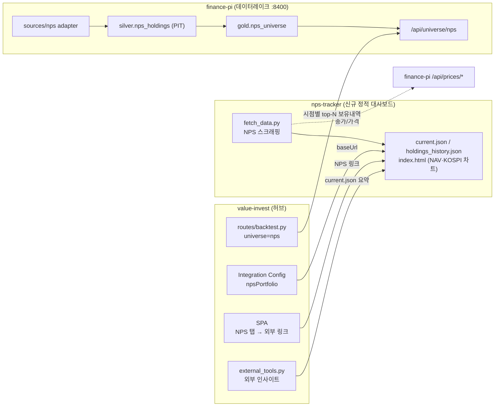

# 국민연금(NPS) 서브프로젝트 분리 계획

작성일: 2026-06-06 · 방향: **대시보드 분리 + 백테스트 유니버스 finance-pi 이관**

## 목표

`value-invest` 내부에 들어 있는 국민연금(NPS) 기능을 두 관심사로 나눠 분리한다.

1. **표시용 대시보드**(공개 NPS 페이지 스크래핑 → NAV·KOSPI 차트) → 독립 정적
   서브프로젝트(`nps-tracker`)로 분리. 기존 4개 대시보드와 동일 패턴.
2. **백테스트 유니버스용 시점별 보유내역**(연구 입력) → `finance-pi`(PIT
   데이터레이크)로 이관. `value-invest` 백테스트는 finance-pi 내부 API에서 읽는다.

핵심 동기는 **배포 게이트 리스크 제거**다. `deploy.sh`가 push마다 전체 `pytest`를
돌리고 1개라도 실패하면 롤백하는데, NPS는 깨지기 쉬운 공개페이지 스크래핑이라
소스 포맷이 바뀌면 허브 전체 배포가 막힌다. 분리하면 이 취약점이 허브에서 빠지고,
배치/테스트 표면이 ~1,850줄 줄며, NPS는 독립 cadence로 실패가 격리된다.

## 현재 구조 (분리 전)

| 구성요소 | 파일 | 비고 |
| --- | --- | --- |
| 스크래퍼 | `nps_scraper.py` (308) | 공개 NPS 페이지 → 보유내역 |
| 스냅샷·HTML 생성 | `snapshot_nps.py` (1176) | NAV/KOSPI 차트 HTML 자체 생성 |
| 백필 | `backfill_nps.py` (143) | 과거 스냅샷 재생성 |
| repository | `repositories/nps.py` (67) | `nps_holdings` / `nps_snapshots` |
| route | `routes/nps.py` (160) | `GET /api/nps/html` (+차트 보정) |
| 배치 트리거 | `routes/internal.py` `POST /api/internal/snapshot/nps` | loopback, systemd `nps-snapshot.timer` 22:05 KST |
| 프런트 | `static/js/portfolio-shell.js` `npsView`/`loadNpsView()` | 독립 탭 → `/api/nps/html` 로딩 |
| **백테스트 결합** | `routes/backtest.py` `source == "nps"` | `nps_holdings` 시총 상위 100 풀을 유니버스로 사용 |

이미 외부화된 의존(분리에 유리):

- **가격 데이터**: `snapshot_nps.py`는 `close_price_client`를 쓰고, 그 BASE_URL은
  `CLOSE_PRICE_API_BASE_URL`(기본 `http://192.168.68.84:8400`) = **finance-pi**다.
  즉 NPS는 이미 finance-pi에서 종가를 받는다 → 인제스트를 finance-pi로 옮기면
  의존이 늘지 않고 한곳으로 합쳐진다.
- **프런트**: NPS는 top-level 독립 탭이라 외부 링크/iframe으로 교체하기 쉽다.

## 목표 구조 (분리 후)



## 레포별 변경

### A. 신규 정적 서브프로젝트 `nps-tracker`

기존 4개 대시보드(`spac-hunter` 등)와 동일 골격.

- `fetch_data.py` — `nps_scraper.py` + `snapshot_nps.py`의 **수집·NAV·렌더링**
  로직 이식. 가격은 finance-pi `/api/prices/*` 또는 KIS에서 직접.
- 발행물:
  - `current.json` — 최신 보유내역 + 요약(총평가액, NAV, 종목수). 허브 인사이트용.
  - `holdings_history.json`(또는 `data.js`) — 차트용 NAV/KOSPI 시계열.
  - `index.html` — NAV vs KOSPI 차트(현재 `snapshot_nps.py`가 만드는 HTML 이식).
- `.github/workflows` — 일 1회(22:05 KST 대응) 스크래핑 → 커밋 → GitHub Pages.
- 배포: `ducklove.github.io/nps-tracker`.

> 레포 이름 결정: **`nps-tracker`** (GitHub Pages `ducklove.github.io/nps-tracker`).

### B. `finance-pi` — NPS 보유내역 PIT 이관

- `src/finance_pi/sources/nps/{adapter,client,schemas}.py` — 공개 NPS 페이지
  어댑터(기존 `nps_scraper.py` 로직을 finance-pi 소스 규약으로).
- 인제스트: `python -m finance_pi.cli.app ingest nps-holdings --since ... --until ...`
  → Bronze(append-only 원본) 적재. `ingest/orchestrator.py`에 등록.
- 변환: `transforms/builders.py`에 `silver.nps_holdings`(stable id 매핑, 날짜별
  보유내역) + `gold.nps_universe`(시점별 시총 상위 N) 빌더 추가.
- API: `admin/server.py`에 `GET /api/universe/nps?date=...&top=...` 추가
  (기존 `/api/prices/*`, `/api/macro/*`와 동형, loopback/LAN 토큰리스).
- 백필: 기존 `backfill_nps.py`가 만든 과거 보유내역을 finance-pi Bronze로 1회 적재.

### C. `value-invest` — 백테스트 재배선 + 내부 NPS 제거

1. **백테스트 재배선** (분리의 핵심 작업):
   - `routes/backtest.py`의 `source == "nps"` 분기를 `nps_holdings` 로컬 테이블
     조회 → finance-pi `/api/universe/nps` 호출로 교체.
   - `close_price_client`에 `fetch_nps_universe(date, top)` 헬퍼 추가(이미 같은
     서버를 가리키므로 클라이언트 확장만).
   - 시점별 동적 top-N 의미가 유지되는지 회귀 테스트(`test_nps_chart_dates.py`
     대체 + 백테스트 universe 케이스).
2. **내부 NPS 제거**:
   - `snapshot_nps.py` / `nps_scraper.py` / `backfill_nps.py` / `repositories/nps.py`
     / `routes/nps.py` 삭제.
   - `routes/internal.py`의 `/snapshot/nps` 제거, systemd `nps-snapshot.timer` 폐기.
   - `cache.py`의 `nps_holdings` / `nps_snapshots` 테이블 + 재노출 함수 제거
     (마이그레이션: 테이블 drop은 보류하고 deprecate만 → 안전).
   - 프런트 `npsView` 탭은 **유지**하되, `loadNpsView()`가 `/api/nps/html`(내부
     생성) 대신 **nps-tracker를 iframe으로 임베드**하도록 변경(결정: iframe 유지).
3. **통합 추가**:
   - `integrations.py` `DEFAULT_BASE_URLS`에 `npsPortfolio` 추가 + `?date=`/링크.
   - `external_tools.py`에 `_summarize_nps()` 추가(5번째 대시보드 요약).
   - 아키텍처 문서 4종 갱신(graph/linked-projects/health-review/architecture.html).

## Published 스키마(초안)

```jsonc
// nps-tracker/current.json
{
  "lastUpdated": "2026-06-05 22:07:00",
  "summary": { "totalValue": 0, "nav": 1000.0, "count": 0, "asOf": "2026-06-05" },
  "holdings": [
    { "stock_code": "005930", "stock_name": "삼성전자",
      "shares": 0, "ownership_pct": 0, "price": 0, "market_value": 0, "change_pct": 0 }
  ]
}
```

```jsonc
// finance-pi  GET /api/universe/nps?date=2024-12-31&top=100
{ "date": "2024-12-31", "as_of": "2024-12-31",
  "universe": [ { "stock_code": "005930", "market_value": 0, "rank": 1 } ] }
```

## 마이그레이션 순서 (무중단·게이트별)

1. **finance-pi에 NPS 인제스트 구축 + 백필**. 허브는 그대로. `/api/universe/nps`가
   기존 `nps_holdings`와 동일 결과를 내는지 비교 검증.
2. **백테스트 재배선**(value-invest). 로컬 테이블과 finance-pi API 결과를 동시
   비교하는 shadow 모드로 한동안 운영 → 일치 확인 후 로컬 의존 제거.
3. **nps-tracker 신규 레포** 구축·배포. 허브 NPS 탭이 아직 내부 HTML이어도 무방.
4. **허브 프런트/통합 전환**: NPS 탭 → 외부 대시보드, 통합 설정/인사이트 추가.
5. **내부 NPS 코드·타이머·테스트 제거**. 마지막에. 테이블 drop은 더 뒤로.
6. **문서 갱신** 및 정리.

각 단계는 그 자체로 배포 가능하고, 1→2 사이가 가장 위험하므로 shadow 비교를 길게 둔다.

## 리스크 & 롤백

- **백테스트 결과 변동**: finance-pi 유니버스가 로컬과 미세하게 달라질 수 있음
  (가격 시점/식별자 매핑). → shadow 비교 + 동결 스냅샷 회귀 테스트로 차단.
- **finance-pi 가용성**: 허브 백테스트가 finance-pi에 런타임 의존하게 됨(현재 종가
  백업과 동일 리스크). → 캐시 + 명확한 실패 메시지. NPS 유니버스는 실시간성이
  낮으므로 일 1회 캐시로 충분.
- **롤백**: 5단계(코드 제거) 전까지는 내부 NPS가 살아 있어 언제든 되돌릴 수 있음.

## 결정사항 (2026-06-06)

- 신규 레포 이름: **`nps-tracker`**.
- 허브 NPS 탭: **iframe 임베드 유지**(탭 유지, `loadNpsView()`가 nps-tracker를 iframe).
- 착수 지점: **Phase 1 (finance-pi NPS 인제스트 구축)** 부터.

### 아직 열린 것

- finance-pi 유니버스 API 경로·인증(`/api/universe/nps` vs `/api/nps/holdings`).
- 과거 `nps_snapshots.generated_html`(차트) 자산을 nps-tracker로 이관할지/재생성할지.

## 구현 상태 (value-invest, 2026-06-06)

레포 C(`value-invest`) 작업 완료. 다만 **백테스트 재배선(원안 B/C-1)은 백테스트
자체가 레거시로 제거되면서 불필요해졌다** — `routes/backtest.py`의 `universe="nps"`는
실제로는 `nps_holdings`가 아니라 네이버 시총 순위를 쓰는 '시총 Top 30'이었고, 이미
메인 탭에서 빠진 실험 기능이라 통째로 제거했다. 따라서 `value-invest`는 finance-pi
`/api/universe/nps`에 런타임 의존하지 않는다(해당 API/인증 결정도 보류 무효화).

완료된 것:

- **백테스트 레거시 제거**: `routes/backtest.py`·`static/js/backtest.js` 및 라우터·SPA
  경로·딥링크·실험실 카드·전용 `.bt-*` CSS 정리(`.bt-run`은 포트폴리오 AI 버튼이 재사용해 보존).
- **NPS 탭 → nps-tracker iframe**: `loadNpsView()`가 `/api/nps/html`(내부 생성) 대신
  `https://ducklove.github.io/nps-tracker/`를 iframe 임베드(`integrations.npsTracker.baseUrl`).
- **통합**: `integrations.py` `npsTracker` baseUrl + `external_tools._summarize_nps`
  (5번째 대시보드 요약 — 투자정보 '분석 도구' 카드에 비중 상위·NAV로 노출).
- **내부 NPS 제거**: `snapshot_nps`·`nps_scraper`·`backfill_nps`·`repositories/nps`·
  `routes/nps` 삭제, internal `/snapshot/nps`·admin 트리거/모니터링·systemd
  `nps-snapshot.timer/service`·`deploy.sh` 5월 repair 블록 정리. `nps_holdings`/
  `nps_snapshots` 테이블은 롤백 대비 보존(deprecate, drop 보류).
- **테스트·문서**: NPS 전용 테스트 제거·batch 모니터링 테스트를 portfolio-snapshot으로
  재배선, 전체 `pytest` 644 통과. 아키텍처 문서 4종 갱신.
