# Project Architecture Graph

작성일: 2026-04-30 · 갱신일: 2026-06-04 (finance-pi, spac-hunter 반영)

```mermaid
flowchart TB
  User["사용자<br/>Desktop / Mobile Browser"]
  Admin["관리자<br/>/admin.html"]
  GitHubPages["GitHub Pages<br/>ducklove.github.io<br/>redirect / linked dashboards"]
  Pi["Raspberry Pi Server<br/>value-invest FastAPI<br/>cantabile.tplinkdns.com:3691"]
  SQLite[("SQLite cache.db<br/>users / portfolio / NAV<br/>analysis cache / AI usage<br/>wiki / DART reviews / events")]

  User -->|"HTTPS app"| Pi
  Admin -->|"Google login + admin APIs"| Pi
  GitHubPages -->|"redirect to app server"| Pi
  Pi --> SQLite

  subgraph ValueInvest["value-invest (포트폴리오·분석 허브)"]
    Static["Static SPA<br/>index.html + split portfolio JS"]
    API["FastAPI Routes<br/>analysis / portfolio / reports<br/>wiki / auth / admin / integrations"]
    WS["WebSocket Quotes<br/>KIS realtime ticks"]
    Batch["Batch / Internal APIs<br/>snapshot NAV / intraday<br/>wiki ingestion / DART review"]
    AI["AI Layer<br/>OpenRouter models<br/>portfolio insight / wiki Q&A<br/>DART filing review"]
    Integrations["Integration Config<br/>/app-config.js<br/>/api/integrations<br/>linked_project_admin.py"]
    Insights["External Insights<br/>external_tools.py<br/>대시보드 published JSON 요약"]

    Static --> API
    Static --> WS
    API --> SQLite
    WS --> API
    Batch --> API
    AI --> SQLite
    API --> AI
    AI --> Insights
    Integrations --> Static
    Integrations --> API
  end

  Pi -.serves.-> Static
  Pi -.runs.-> API
  Pi -.runs.-> WS
  Pi -.runs.-> Batch
  Pi -.runs.-> AI
  Pi -.loads.-> Integrations

  subgraph SharedInfra["공용 인프라 (상시 서버)"]
    KisProxy["kis-proxy<br/>FastAPI :3288<br/>KIS 인증대행·조회 프록시"]
    FinancePi["finance-pi<br/>Raspberry Pi 데이터레이크 :8400<br/>Bronze/Silver/Gold + 백테스트<br/>내부 prices/macro/fundamentals API"]
  end

  subgraph Dashboards["Linked Dashboards (GitHub Pages)"]
    Holding["holding_value<br/>지주사 가치 대시보드<br/>config.json / api/holdings.json"]
    Preferred["common_preferred_spread<br/>보통주·우선주 괴리율<br/>config.json / current.json / data.js"]
    GoldGap["gold_gap<br/>금/BTC 김치프리미엄<br/>Flask + 정적 / config.json / data.json"]
    SpacHunter["spac-hunter<br/>스팩 공모가 괴리·합병<br/>current.json / data.js"]
  end

  %% 허브 → 대시보드 (설정/딥링크)
  Integrations -->|"local config or public fallback"| Holding
  Integrations -->|"local config or public fallback"| Preferred
  Integrations -->|"local config or public fallback"| GoldGap
  Integrations -->|"baseUrl only (config 없음)"| SpacHunter
  Static -->|"지주사 링크 ?code= + holdings.json"| Holding
  Static -->|"우선주 괴리율 링크 ?code="| Preferred
  Static -->|"금/BTC gap 링크 ?asset="| GoldGap
  Static -->|"스팩 링크 ?code="| SpacHunter

  %% 허브 → 대시보드 (서버사이드 외부 인사이트)
  Insights -->|"current.json 요약 (raw.githubusercontent)"| Holding
  Insights -->|"current.json 요약"| Preferred
  Insights -->|"data.json 요약"| GoldGap
  Insights -->|"current.json 요약"| SpacHunter

  %% 허브 → 공용 인프라
  API -->|"server-side quote/history calls"| KisProxy
  WS -->|"KIS realtime connection manager"| KisProxy
  API -.->|"종가 백업 API (192.168.68.84:8400)"| FinancePi

  %% 대시보드 → 공용 인프라
  Holding -->|"시세 history"| KisProxy
  Preferred -->|"시세 history"| KisProxy
  Preferred -->|"종가/거시/배당 내부 API"| FinancePi

  %% 개념적 연결 (런타임 의존 없음)
  FinancePi -. "SPAC 합병 정체성 모델(§4.3) 개념 공유" .- SpacHunter

  subgraph ExternalData["External Data Sources"]
    GoogleOAuth["Google OAuth"]
    GoogleSheets["Google Sheets<br/>preferred dividends"]
    KRX["KRX / KIND<br/>상장종목·공시목록"]
    DART["DART 공시 API"]
    Naver["Naver Finance / Reports"]
    Yahoo["Yahoo Finance / yfinance"]
    Crypto["Upbit / Bithumb / Binance<br/>gold.org"]
    KIS["Korea Investment Securities API"]
    OpenRouter["OpenRouter AI Gateway"]
  end

  API -->|"login/session"| GoogleOAuth
  API -->|"corp codes / filings"| DART
  API -->|"reports / Naver finance links"| Naver
  API -->|"foreign dividends / benchmarks"| Yahoo
  API -->|"preferred dividends refresh"| GoogleSheets
  AI --> OpenRouter
  KisProxy --> KIS

  %% finance-pi 수집 소스
  FinancePi --> KIS
  FinancePi --> KRX
  FinancePi --> DART
  FinancePi --> Naver

  %% 대시보드 직접 소스
  Preferred --> KIS
  Preferred --> Naver
  Holding --> KIS
  Holding --> Yahoo
  GoldGap --> Crypto
  GoldGap --> Naver
  SpacHunter --> KRX
  SpacHunter --> DART
  SpacHunter --> Naver

  subgraph Systemd["Systemd Timers / Services"]
    NavTimer["portfolio-snapshot.timer<br/>daily NAV"]
    IntradayTimer["portfolio-intraday.timer<br/>intraday snapshots"]
    WikiTimer["wiki-ingestion.timer<br/>broker report wiki"]
    DartTimer["dart-review-ingestion.timer<br/>filing AI review"]
  end

  NavTimer -->|"POST /api/internal/snapshot/nav"| Batch
  IntradayTimer -->|"POST /api/internal/snapshot/intraday"| Batch
  WikiTimer -->|"POST /api/internal/wiki/ingest"| Batch
  DartTimer -->|"POST /api/internal/dart-review/ingest"| Batch

  subgraph AdminOps["Admin Operations"]
    LinkedConfig["linked project config 관리"]
    AIConfig["AI key / feature model 관리"]
    Usage["AI usage / system events"]
    ManualJobs["manual batch trigger"]
    Diagnostics["diagnostics / deploy status"]
  end

  Admin --> LinkedConfig
  Admin --> AIConfig
  Admin --> Usage
  Admin --> ManualJobs
  Admin --> Diagnostics
  LinkedConfig --> Integrations
  AIConfig --> AI
  Usage --> SQLite
  ManualJobs --> Batch
  Diagnostics --> API
```

## 핵심 해석

- `value-invest`는 사용자 포트폴리오와 분석을 모으는 허브다.
- 연관 저장소는 **공용 인프라**와 **링크 대시보드** 두 계층으로 나뉜다.
  - 공용 인프라(상시 서버): `kis-proxy`(:3288, KIS 인증대행·조회 프록시), `finance-pi`(:8400, 라즈베리파이 데이터레이크·백테스트 플랫폼 + 내부 prices/macro/fundamentals API).
  - 링크 대시보드(GitHub Pages): `holding_value`, `common_preferred_spread`, `gold_gap`, `spac-hunter`.
- 4개 대시보드(`holding_value`, `common_preferred_spread`, `gold_gap`, `spac-hunter`)는 독립 배포를 유지하고, `value-invest`가 **두 경로로 동일하게** 연결한다.
  - 통합 설정/딥링크: `integrations.py`가 각 프로젝트 `baseUrl`을 노출하고(`/app-config.js`), 프런트가 포트폴리오 행을 `?code=`(스팩·우선주·지주사)·`?asset=`(gold/btc)로 해당 대시보드에 딥링크한다. 단 `spacHunter`는 로컬 config 없이 `baseUrl`만 노출한다.
  - 서버사이드 외부 인사이트: `external_tools.py`가 각 대시보드의 published JSON(`current.json`/`data.json`)을 `raw.githubusercontent`에서 받아 요약하고(`fetch_external_insights`), AI 포트폴리오 인사이트의 입력으로 쓴다.
- `kis-proxy`는 브라우저 직접 호출 대상이 아니라 서버/KIS 실시간 계층, 그리고 `holding_value`·`common_preferred_spread`의 시세 history 조회가 함께 사용하는 프록시다.
- `finance-pi`는 KRX·DART·KIS·Naver를 수집해 Gold 테이블로 만들고 내부 API를 노출한다. `common_preferred_spread`가 종가/거시지표/배당을 끌어다 쓰고, `value-invest`는 KIS history가 비었을 때의 종가 백업 소스(`CLOSE_PRICE_API_BASE_URL`)로 사용한다.
- `spac-hunter`는 KRX/KIND·DART·Naver를 직접 수집하는 정적 대시보드이며, 위 두 경로로 `value-invest` 허브에 연결된다. 추가로 `finance-pi` 아키텍처 문서 §4.3의 스팩 합병 정체성 모델(`spac_pre`/`spac_post`)과 도메인 개념을 공유한다(런타임 의존 아님).
- 운영 자동화는 systemd timer가 `/api/internal/*`를 호출하는 구조다.
- 관리자 화면은 linked project config, AI 모델/키, 수동 배치, 이벤트/진단을 한곳에서 관리하는 운영 콘솔이다.
