# Project Architecture Graph

작성일: 2026-04-30

```mermaid
flowchart TB
  User["사용자<br/>Desktop / Mobile Browser"]
  Admin["관리자<br/>/admin.html"]
  GitHubPages["GitHub Pages<br/>ducklove.github.io<br/>redirect / linked dashboards"]
  Pi["Raspberry Pi Server<br/>value-invest FastAPI<br/>cantabile.tplinkdns.com:3691"]
  SQLite[("SQLite cache.db<br/>users / portfolio / NAV<br/>analysis cache / AI usage<br/>wiki / DART reviews / events")]

  User -->|"HTTPS app"| Pi
  Admin -->|"Google login + admin APIs"| Pi
  GitHubPages -->|"redirect to app server"| Pi
  Pi --> SQLite

  subgraph ValueInvest["value-invest"]
    Static["Static SPA<br/>index.html + split portfolio JS"]
    API["FastAPI Routes<br/>analysis / portfolio / reports<br/>wiki / auth / admin / integrations"]
    WS["WebSocket Quotes<br/>KIS realtime ticks"]
    Batch["Batch / Internal APIs<br/>snapshot NAV / intraday / NPS<br/>wiki ingestion / DART review"]
    AI["AI Layer<br/>OpenRouter models<br/>portfolio insight / wiki Q&A<br/>DART filing review"]
    Integrations["Integration Config<br/>/app-config.js<br/>/api/integrations<br/>linked_project_admin.py"]

    Static --> API
    Static --> WS
    API --> SQLite
    WS --> API
    Batch --> API
    AI --> SQLite
    API --> AI
    Integrations --> Static
    Integrations --> API
  end

  Pi -.serves.-> Static
  Pi -.runs.-> API
  Pi -.runs.-> WS
  Pi -.runs.-> Batch
  Pi -.runs.-> AI
  Pi -.loads.-> Integrations

  subgraph SubProjects["Linked Subprojects"]
    Holding["holding_value<br/>GitHub Pages dashboard<br/>config.json / api/holdings.json"]
    Preferred["common_preferred_spread<br/>GitHub Pages dashboard<br/>config.json / current.json / data.js"]
    GoldGap["gold_gap<br/>GitHub Pages dashboard<br/>config.json / data.json"]
    KisProxy["kis-proxy<br/>public KIS proxy<br/>cantabile.tplinkdns.com:3288"]
  end

  Integrations -->|"read local config or public fallback"| Holding
  Integrations -->|"read local config or public fallback"| Preferred
  Integrations -->|"read local config or public fallback"| GoldGap
  API -->|"server-side quote/order-compatible calls"| KisProxy
  WS -->|"KIS realtime connection manager"| KisProxy

  Static -->|"지주사 링크"| Holding
  Static -->|"우선주 괴리율 링크"| Preferred
  Static -->|"금/BTC gap 링크"| GoldGap

  subgraph ExternalData["External Data Sources"]
    GoogleOAuth["Google OAuth"]
    GoogleSheets["Google Sheets<br/>preferred dividends"]
    DART["DART 공시 API"]
    Naver["Naver Finance / Reports"]
    Yahoo["Yahoo Finance / yfinance"]
    KIS["Korea Investment Securities API"]
    OpenRouter["OpenRouter AI Gateway"]
  end

  API -->|"login/session"| GoogleOAuth
  API -->|"corp codes / filings"| DART
  API -->|"reports / Naver finance links"| Naver
  API -->|"foreign dividends / benchmarks"| Yahoo
  API -->|"preferred dividends refresh"| GoogleSheets
  KisProxy --> KIS
  AI --> OpenRouter

  subgraph Systemd["Systemd Timers / Services"]
    NavTimer["portfolio-snapshot.timer<br/>daily NAV"]
    IntradayTimer["portfolio-intraday.timer<br/>intraday snapshots"]
    NpsTimer["nps-snapshot.timer<br/>NPS holdings"]
    WikiTimer["wiki-ingestion.timer<br/>broker report wiki"]
    DartTimer["dart-review-ingestion.timer<br/>filing AI review"]
  end

  NavTimer -->|"POST /api/internal/snapshot/nav"| Batch
  IntradayTimer -->|"POST /api/internal/snapshot/intraday"| Batch
  NpsTimer -->|"POST /api/internal/snapshot/nps"| Batch
  WikiTimer -->|"POST /api/internal/wiki/ingest"| Batch
  DartTimer -->|"POST /api/internal/dart-review/ingest"| Batch

  subgraph AdminOps["Admin Operations"]
    LinkedConfig["linked project config 관리"]
    AIConfig["AI key / feature model 관리"]
    Usage["AI usage / system events"]
    ManualJobs["manual batch trigger"]
    Diagnostics["diagnostics / deploy status"]
  end

  Admin --> LinkedConfig
  Admin --> AIConfig
  Admin --> Usage
  Admin --> ManualJobs
  Admin --> Diagnostics
  LinkedConfig --> Integrations
  AIConfig --> AI
  Usage --> SQLite
  ManualJobs --> Batch
  Diagnostics --> API
```

## 핵심 해석

- `value-invest`는 사용자 포트폴리오와 분석을 모으는 허브다.
- `holding_value`, `common_preferred_spread`, `gold_gap`은 독립 배포를 유지하고, `value-invest`가 설정과 링크를 읽어 연결한다.
- `kis-proxy`는 브라우저 직접 호출 대상이 아니라 서버/KIS 실시간 계층이 사용하는 외부 프록시다.
- 운영 자동화는 systemd timer가 `/api/internal/*`를 호출하는 구조다.
- 관리자 화면은 linked project config, AI 모델/키, 수동 배치, 이벤트/진단을 한곳에서 관리하는 운영 콘솔이다.
