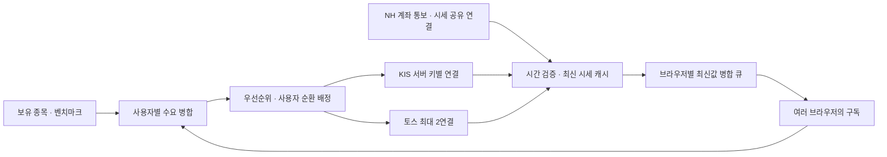

# 공통 실시간 시세 모듈

2026-10-08 구현. NH·KIS·토스의 시세를 서버가 관리하고 `/ws/quotes`로 인증된 브라우저에 전달한다. 브라우저별 증권사 연결 점유·강제 takeover는 제거했다. 토스는 시세 체결 채널만 사용하며 계좌 조회·주문을 호출하지 않는다.

## 책임과 연결 소유권

- `services/realtime/allocation.py`: I/O 없는 수요 정규화·순환 배정. 보유 → 벤치마크 → 사이드바 → 분석 우선순위다. 같은 사용자의 탭은 하나로 합치고, 같은 종목은 한 공급원에만 배정한다. 가능한 기존 배정을 유지해 재구독을 줄인다.
- `services/realtime/hub.py`: 앱 수명주기에서 시작·종료하는 연결 소유자. 보유 수요는 15초, 연결 승인·브라우저 계획은 약 1초마다 재확인한다. 체결은 폴링을 기다리지 않고 즉시 전달한다.
- `services/realtime/kis.py`: 서버의 KIS 환경변수 키별 연결. 같은 키의 연결 계좌 통보를 같은 소켓에 합치고 해당 등록 수를 40건에서 차감한다. 다른 계좌 키의 기존 통보 런타임은 유지한다.
- `services/realtime/toss.py`: 공식 OAuth form 요청, 두 소켓에 공유하는 토큰 잠금, full-replace 구독과 요청 ID별 ACK, 재접속·지수 백오프, TLS 및 표준 ping/pong. 토큰 재발급은 이전 토큰을 무효화하므로 소켓마다 따로 발급하지 않는다.
- `services/brokers/realtime.py`: NH의 기존 키별 국내·해외 연결·통보·스캐너 예약 관리. 승인 종목을 공통 배정기에 알리고 수신 시세를 사용자 범위로 전달한다. 기존 NH 복구 API와 요청 속도 제한을 유지한다.

현재 운영은 단일 Uvicorn 프로세스다. `data/realtime-owner.lock`의 OS 잠금이 두 번째 공통 시세 소유자의 시작을 막는다. 프로세스·호스트를 늘릴 때는 연결 소유자를 별도 작업자로 분리하고 메시지 버스와 키별 분산 임대를 추가해야 한다. 잠금만으로 다중 프로세스 브라우저 전달이 지원되는 것은 아니다.

## 시세 정확성과 장애 대응

TCP 연결과 구독 승인을 구분한다. 브라우저의 `ws` 목록에는 ACK 승인 종목만 넣고 대기·거절·한도 밖 종목은 `rest` 목록에 넣는다. 소켓 종료 시 승인을 지우고 조회 시세로 복귀한다. 구독 거절은 다른 공급원으로 재배정하며 연결 장애는 재접속과 대체 공급원·조회 시세를 사용한다.

체결 시각이 90초 이상 지난 가격, 미래 가격, 유효하지 않은 가격은 수신으로 표시하지 않는다. 거래가 없는 동안은 구독 승인과 체결 수신을 따로 보여준다. 느린 브라우저의 큐는 종목별 최신값을 합치며 업스트림 수신을 막지 않는다. NH 가격은 해당 키의 사용자에게만 전달하고 다른 사용자의 종목·계좌 정보는 보내지 않는다.

토스 체결의 `volume`은 개별 체결량이므로 일 누적 거래량으로 저장하지 않는다. 체결 메시지에 전일 종가가 없어 기존 조회 시세의 기준가를 보완한다. 미국 가격은 기존 포트폴리오 규칙과 동일하게 원화로 환산하고 원래 가격·통화·환율을 함께 보낸다. 그 외 해외시장·특수자산은 NH 지원 범위 또는 기존 조회 경로를 사용한다.

## 설정과 진단

서버 `.env`의 `TOSS_CLIENT_ID`, `TOSS_CLIENT_SECRET`을 읽는다. 토스 WTS의 허용 IP에는 서버 외부 IP가 등록돼 있어야 한다. 인증정보를 프론트나 응답·로그로 보내지 않는다.

관리자 `GET /api/realtime/status`는 소유자 상태, 공급원별 요청·승인·거절 수, 오류 분류, 마지막 프레임·체결 시각, 재접속 횟수를 반환한다. 원문 오류·키·토큰·계좌번호는 포함하지 않는다. `Realtime source:` 로그에는 상태가 변할 때만 집계 수치를 남긴다.

- `ip_not_allowed`: 토스 WTS 허용 IP 확인.
- `authentication_error`: 토스 클라이언트 정보·활성 상태 확인.
- `subscription_timeout`: 선언 ID·ACK·네트워크 확인.
- `integrated_subscription_rejected`: KIS 통합 시세 권한 확인. 다른 공급원 또는 조회 시세 보완.
- NH `WSS10015`: 키별 소켓 예약과 기존 세션 복구 기록 확인.
- `owner_conflict`: 중복 프로세스 확인. 다중 worker를 추가하지 않는다.

화면은 공통 승인·수신·조회 보완 수와 증권사별 상태를 보여준다. NH의 개별 제한을 전체 시세 연결 장애로 표시하지 않는다.

공식 명세: [토스 REST](https://openapi.tossinvest.com/openapi-docs/latest/openapi.json), [토스 실시간](https://openapi.tossinvest.com/openapi-docs/latest/asyncapi.json), [KIS 공식 샘플](https://github.com/koreainvestment/open-trading-api).
