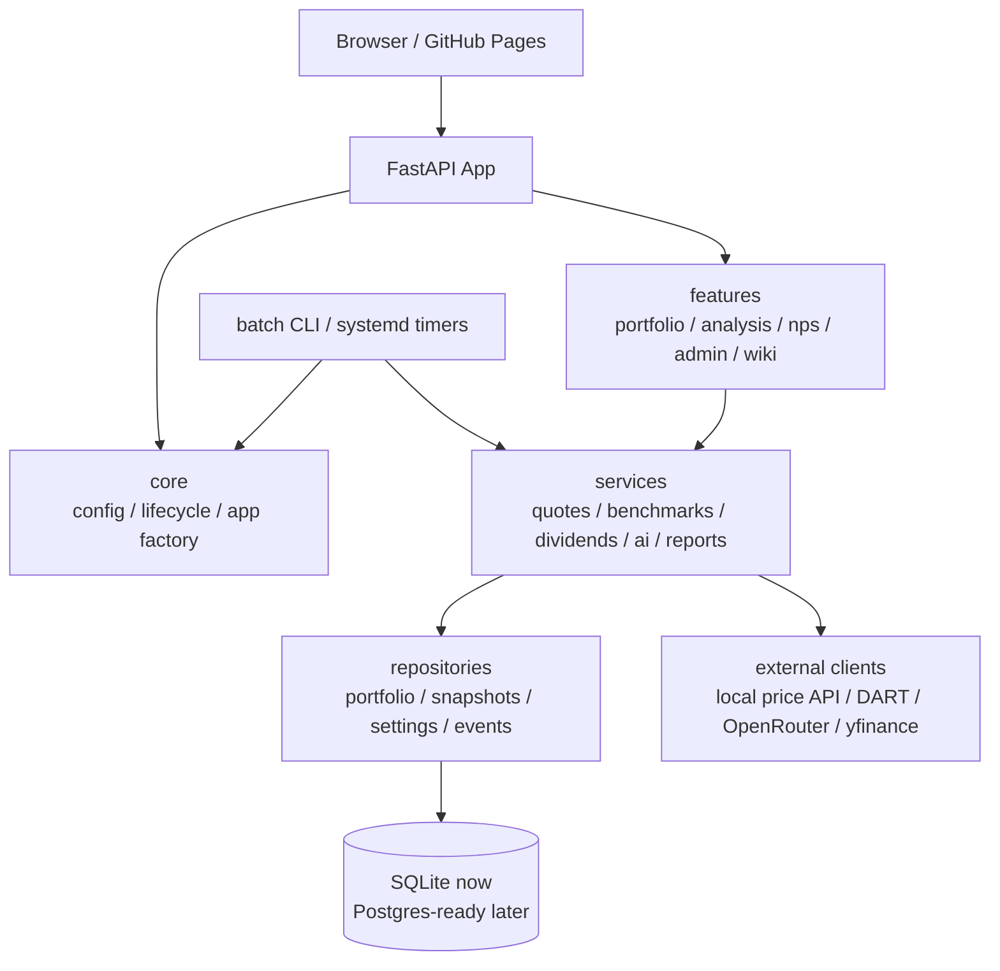

# Value Compass 재설계 계획

## 목표

작은 UI/데이터 수정이 포트폴리오 로딩, 실시간 시세, 배치 스냅샷, 관리자 기능까지 흔드는 현재 구조를 끊어낸다. 이번 리팩토링은 기능을 한 번에 갈아엎는 작업이 아니라, 운영 안정성을 유지하면서 결합도를 낮추는 단계적 재설계다.

## 현재 핵심 문제

- `main.py`가 환경 로딩, 앱 생성, CORS, 라우터 연결, 라이프사이클 작업, 정적 파일 서빙까지 모두 담당한다.
- `cache.py`는 DB 스키마, 마이그레이션, repository, 일부 비즈니스 규칙을 모두 가진 단일 허브다.
- `routes/portfolio.py`는 API 라우터, 외부 시세, 배당, 목표가, AI 인사이트, 벤치마크, 현금흐름까지 섞여 있다.
- 프론트엔드는 파일이 나뉘었지만 전역 상태(`portfolioItems`, `pfBenchmarkQuotes`, `pfNavHistory`)에 강하게 의존한다.
- 배치 작업과 웹 앱이 같은 모듈을 직접 import하며, 일부 설정은 import 시점에 고정된다.
- 운영 설정이 `.kis.env`, `keys.txt`, systemd `Environment`, 코드 기본값에 분산되어 있다.

## 목표 구조

## 단계별 이행

### 1. 설정과 실행환경 분리

- `core.config`를 단일 환경 로딩 진입점으로 사용한다.
- 환경 파일은 `.env`, `.env.development`, `.env.production` 순서로 분리한다.
- 기존 `.kis.env`와 `keys.txt`는 마이그레이션 기간 동안 유지하되, 새 설정은 profile env 파일로 이동한다.
- systemd에는 `VALUE_INVEST_ENV=production`을 명시한다.

### 2. 앱 조립부 분리

- `main.py`에서 앱 생성 코드를 `core.app_factory:create_app()`로 옮긴다.
- 라우터 등록, middleware, static route, lifespan 작업을 별도 함수로 쪼갠다.
- 테스트는 `create_app(settings)`로 dev/prod 설정을 명시해 검증한다.

### 3. 포트폴리오 도메인 분해

- `routes/portfolio.py`는 HTTP handler만 남긴다.
- 아래 서비스로 분리한다.
- `services/portfolio/quotes.py`: 현재가, 캐시, stale fallback, quote batch.
- `services/portfolio/benchmarks.py`: 벤치마크 기본값, 지수 quote/history.
- `services/portfolio/dividends.py`: DART/local dividend refresh.
- `services/portfolio/targets.py`: 목표가 수식 평가.
- `services/portfolio/insights.py`: AI 인사이트 orchestration.
- `repositories/portfolio.py`: DB 접근만 담당.

### 4. DB 계층 정리

- `cache.py`에서 테이블별 repository를 분리한다.
- 다중 statement write에는 transaction helper와 write lock을 적용한다.
- SQLite는 당분간 유지하되 repository API를 먼저 안정화해 Postgres 전환 가능성을 확보한다.

### 5. 프론트 상태 경계 정리

- 전역 변수 기반을 줄이고 `portfolio-store.js` 같은 상태 모듈을 둔다.
- 렌더 함수는 store snapshot을 받아 DOM만 갱신한다.
- quote tick, flash effect, row action, edit mode가 서로 DOM을 재작성하지 않도록 이벤트 경계를 나눈다.

### 6. 배치와 운영 작업 통합

- `snapshot_nav.py`, `snapshot_nps.py`, `wiki_ingestion.py`, `dart_report_review.py`는 공통 CLI entrypoint 아래로 묶는다.
- 웹 내부 endpoint와 systemd timer가 같은 service 함수를 호출하게 하되, 인증/락/감사는 공통 처리한다.
- 배치별 run record와 duration, 실패 원인을 `system_events` 또는 전용 테이블에 남긴다.

## 우선순위

1. 환경 분리와 설정 단일화.
2. `main.py` app factory 분리.
3. `portfolio.py`에서 quote/benchmark부터 서비스로 추출.
4. `cache.py` repository 분리와 transaction helper.
5. 프론트 portfolio store 도입.

## 이번 브랜치의 첫 변경 범위

- `core.config` 추가.
- `.env.example`, `.env.development.example`, `.env.production.example` 추가.
- `main.py`가 `core.config`를 통해 CORS, app title, public API base URL을 읽도록 변경.
- systemd production profile 명시.

