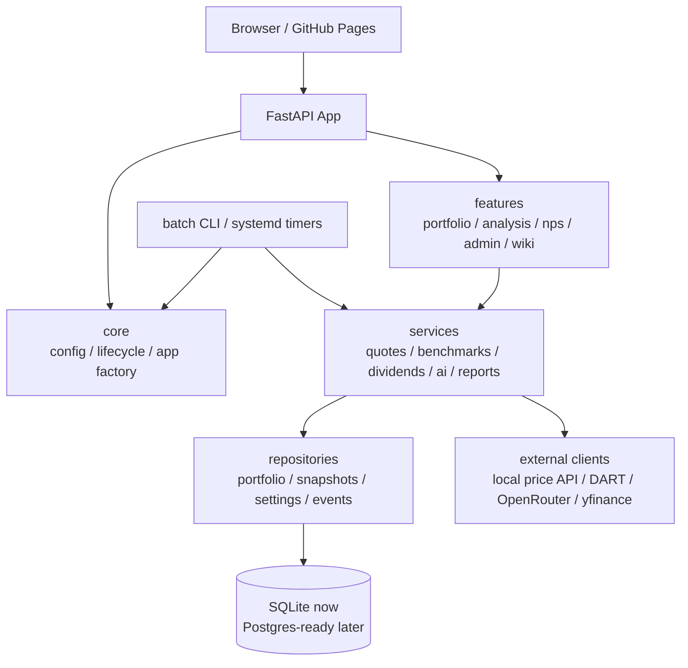

# Value Compass 재설계 계획

## 목표

작은 UI/데이터 수정이 포트폴리오 로딩, 실시간 시세, 배치 스냅샷, 관리자 기능까지 흔드는 현재 구조를 끊어낸다. 이번 리팩토링은 기능을 한 번에 갈아엎는 작업이 아니라, 운영 안정성을 유지하면서 결합도를 낮추는 단계적 재설계다.

## 현재 핵심 문제

- `main.py`가 환경 로딩, 앱 생성, CORS, 라우터 연결, 라이프사이클 작업, 정적 파일 서빙까지 모두 담당한다.
- `cache.py`는 DB 스키마, 마이그레이션, repository, 일부 비즈니스 규칙을 모두 가진 단일 허브다.
- `routes/portfolio.py`는 API 라우터, 외부 시세, 배당, 목표가, AI 인사이트, 벤치마크, 현금흐름까지 섞여 있다.
- 프론트엔드는 파일이 나뉘었지만 전역 상태(`portfolioItems`, `pfBenchmarkQuotes`, `pfNavHistory`)에 강하게 의존한다.
- 배치 작업과 웹 앱이 같은 모듈을 직접 import하며, 일부 설정은 import 시점에 고정된다.
- 운영 설정이 `.kis.env`, `keys.txt`, systemd `Environment`, 코드 기본값에 분산되어 있다.

## 목표 구조

## 단계별 이행

### 1. 설정과 실행환경 분리

- `core.config`를 단일 환경 로딩 진입점으로 사용한다.
- 환경 파일은 `.env`, `.env.development`, `.env.production` 순서로 분리한다.
- 기존 `.kis.env`와 `keys.txt`는 마이그레이션 기간 동안 유지하되, 새 설정은 profile env 파일로 이동한다.
- systemd에는 `VALUE_INVEST_ENV=production`을 명시한다.

### 2. 앱 조립부 분리

- `main.py`에서 앱 생성 코드를 `core.app_factory:create_app()`로 옮긴다. (진행됨)
- 라우터 등록, middleware, static route, lifespan 작업을 별도 함수로 쪼갠다. (진행됨)
- 테스트는 `create_app(settings)`로 dev/prod 설정을 명시해 검증한다. (진행됨)

### 3. 포트폴리오 도메인 분해

- `routes/portfolio.py`는 HTTP handler만 남긴다.
- 아래 서비스로 분리한다.
- `services/portfolio/quotes.py`: 현재가, 캐시, stale fallback, quote batch.
- `services/portfolio/benchmarks.py`: 벤치마크 기본값, 지수 quote/history.
- `services/portfolio/dividends.py`: DART/local dividend refresh.
- `services/portfolio/targets.py`: 목표가 수식 평가.
- `services/portfolio/insights.py`: AI 인사이트 orchestration.
- `repositories/portfolio.py`: DB 접근만 담당.

현재 진행:

- `services/portfolio/identifiers.py`: 포트폴리오 코드 정규화, 국내/우선주/현금성/특수자산 판정 분리 완료.
- `services/portfolio/benchmarks.py`: 기본 벤치마크, 벤치마크 표시명, 지표 등락률 변환, quote cache 분리 완료.
- `services/portfolio/time_windows.py`: 20시 결산 기준 Today window, intraday baseline timestamp 분리 완료.
- `services/portfolio/dividends.py`: 배당 워밍업 대상 선정, 우선주 본주 동시 예열, TTL/running 중복 방지 규칙 분리 완료.
- `services/portfolio/runtime_quotes.py`: 배치/wiki/외국배당 코드가 `routes.portfolio` private 함수에 직접 의존하지 않도록 quote provider seam 추가 완료. 실제 구현은 아직 route runtime에 있으므로 다음 단계에서 `QuoteService`로 이동 필요.
- `services/stock_quotes.py`: 현재가의 단일 진입점 완료 — 국내 주식에 더해 해외 주식·특수자산(현금/금/암호화폐)은 `quote_service`가 주입한 외부 fetcher로, 국내 다건은 `get_bulk_quote_snapshots`(네이버 벌크 1회 호출)로 같은 캐시를 공유한다. `Stock(code, current_price, previous_close, volume, created_at)` 모델, 1회 조회(`get_stock`/`getStock`), 지속 구독(`get_stock_cont`/`getStockCont`), 내부 캐시, WS 우선/REST fallback을 이 모듈에 모았다. API/배치의 현재가 조회는 `stock_price.fetch_quote_snapshot`/`fetch_bulk_quotes_kr`을 직접 호출하지 않고 이 service를 거친다(테스트가 경계 강제). 폴백 정책은 모듈 docstring에 명문화.
- `cache.add_cashflow_and_sync_cash`, `cache.delete_cashflow_and_sync_cash`: 현금흐름과 `CASH_KRW` 잔액 갱신을 단일 transaction으로 묶는 1차 DB 경계 정리 완료.

위 "다음 후보"였던 항목들은 모두 완료됐다:

- `services/stock_quotes.py` 해외·특수자산 확장 + 국내 벌크 경로 흡수 (2026-06-11).
- `services/portfolio/names.py`, `targets.py`(+`target_resolver.py`/`target_metrics.py`), `history.py` 분리 완료.

남은 것: `routes/portfolio.py`는 1,195줄로 목표(1,000줄 미만)에 아직 못 미친다 — 다음 추출 후보를 정할 때 갱신할 것.

### 4. DB 계층 정리

- `cache.py`에서 테이블별 repository를 분리한다.
- 다중 statement write에는 transaction helper와 write lock을 적용한다.
- cashflow처럼 이미 다중 write인 경로부터 전용 transaction 함수로 묶고, 반복 패턴이 3개 이상 쌓이면 공통 helper로 승격한다.
- SQLite는 당분간 유지하되 repository API를 먼저 안정화해 Postgres 전환 가능성을 확보한다.

### 5. 프론트 상태 경계 정리

- 전역 변수 기반을 줄이고 `portfolio-store.js` 같은 상태 모듈을 둔다.
- 렌더 함수는 store snapshot을 받아 DOM만 갱신한다.
- quote tick, flash effect, row action, edit mode가 서로 DOM을 재작성하지 않도록 이벤트 경계를 나눈다.

### 6. 배치와 운영 작업 통합

- `snapshot_nav.py`, `snapshot_nps.py`, `wiki_ingestion.py`, `dart_report_review.py`는 공통 CLI entrypoint 아래로 묶는다.
- 웹 내부 endpoint와 systemd timer가 같은 service 함수를 호출하게 하되, 인증/락/감사는 공통 처리한다.
- 배치별 run record와 duration, 실패 원인을 `system_events` 또는 전용 테이블에 남긴다.

## 우선순위

1. 환경 분리와 설정 단일화. (완료)
2. `main.py` app factory 분리. (완료)
3. `portfolio.py`에서 quote/benchmark부터 서비스로 추출. (완료 — 2026-06-11, names/targets/배당 워밍업/벌크 시세 포함)
4. `cache.py` repository 분리와 transaction helper. (완료 — 2026-06-10)
5. 프론트 portfolio store 도입. (완료 — 2026-06-10)

## 2026-06-11 진행 기록

리팩토링 리뷰(`docs/refactoring-review-2026-06.html`) Phase 2 잔여 2건 처리:

- **2-1 시세 단일화 마무리**: 국내 벌크 시세(`fetch_bulk_quotes_kr`)의 마지막
  직접 호출(`routes/portfolio.py`)을 `services/stock_quotes.get_bulk_quote_snapshots`
  로 흡수 — 벌크 결과가 단건 경로와 같은 캐시에 기록된다. 폴백 정책
  (메모리 캐시 → KIS WS → KIS REST/NXT 재시도/외부 fetcher → dead-cache+stale)을
  모듈 docstring에 명문화하고, `fetch_quote_snapshot`/`fetch_bulk_quotes_kr`
  직접 호출 금지를 구조 테스트로 강제.
- **2-5 예외 처리 체계화(기반 + 1차 적용)**: `core/errors.py`에
  `AppError(RuntimeError)` / `ExternalServiceError`(502) / `RateLimitError`(429) /
  `DBError`(500) 계층과 `register_exception_handlers()` 도입, app factory에서 등록.
  `KISProxyError`·`ClosePriceClientError`를 `ExternalServiceError`로 재베이스
  (RuntimeError 상속 유지로 기존 핸들러 호환), `repositories/db.transaction()`이
  sqlite 오류를 `DBError`로 변환(메시지·cause 보존). **잔여**: 라우트별 광역
  `except Exception`의 점진 교체는 파일 단위로 계속한다.
- **auth 상태 복원력**: `/api/auth/me`의 네트워크 오류·5xx를 "비로그인"으로
  오판해 로그인 UI가 깜빡이던 문제 수정 — 4xx/명시적 user:null만 로그아웃
  판정, 그 외에는 직전 상태 유지. jsdom 행위 테스트 7건 추가.

## 2026-06-10 진행 기록

상세 평가와 후속 로드맵은 `docs/refactoring-review-2026-06.html` 참고.

- **4단계 완료**: `repositories/db.py`가 커넥션 싱글턴(DB_PATH/get_db/close_db)과
  `transaction()`(공유 단일 커넥션 직렬화, BEGIN IMMEDIATE, 재진입 합류)을 소유.
  repository 19개와 레거시 모듈 11개(ai_config, market_daily, snapshot_*, wiki_ingestion,
  observability, *_dividends, benchmark_history, dart_report_review, deps)가 cache 재수출
  대신 repository를 직접 import. cache.py에는 스키마(init_db)·corp-code 헬퍼·
  남은 소비자(routes/services)용 재수출만 잔존. 다중 statement 쓰기 11곳 원자화.
- **5단계 완료**: `PfStore`가 파일 간 공유 상태 23개를 소유(sort/filters/edit/
  manualOrder/snapshots/currency/prefs). 파일 로컬 plumbing만 모듈 상단 `let`.
- **대형 파일 분할**: analysis.js → analysis-charts/analysis-filings/본체(각 1,000줄 미만),
  admin.js → admin-observability/admin-linked-projects/본체. 분할 계약은
  test_frontend_structure.py가 강제.
- **배포 게이트**: ruff(F·E9) → pytest → JS 테스트(node 가용 시) 3중 차단 게이트,
  healthz 실패 시 OLD_SHA 롤백·재기동. `pyproject.toml`이 lint 규칙의 단일 출처.
- **프런트 fetch 계층**: apiFetch 타임아웃(스트리밍 제외) + reportApiError(토스트/무음).
- **신규 기능**: `GET /api/portfolio/risk` — NAV 기반 리스크 지표(수익률·변동성·MDD·
  샤프·베타/상관, 1M~ALL 윈도우).

## 이번 브랜치의 첫 변경 범위

- `core.config` 추가.
- `.env.example`, `.env.development.example`, `.env.production.example` 추가.
- `main.py`가 `core.config`를 통해 CORS, app title, public API base URL을 읽도록 변경.
- systemd production profile 명시.
